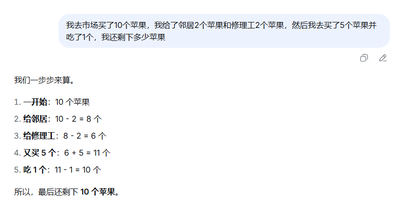

# 提示词工程指南

## 提示词工程概念

提示词工程：我们向大模型提出的问题叫“提示词”，提示词工程就是一门关注提示词编写和优化的学科。简单理解就是教我们怎么向大模型提问。

## 提示词组成部分

提示词组成四要素：**指令**、**上下文**、**输入**、**输出**。

一些很简单的问题，比如“讲个笑话”、“对文章写一个总结”、“写一个遍历目录函数”等等，这些都不是完备的提示词，比如“写一个遍历目录函数”这个问题，多数大模型会返回 python 编写的代码。而我是一个前端开发，更希望得到 JavaScript 代码。问题原因就是没有在提问中指名你需要返回的编程语言类型。

一个好的提示词一定是包含整个完整构成要素的。机器学习大佬吴恩达曾总结出提示词必备的四个基本要素：

- **指令**：想要模型执行的特定任务的说明。
- **输入数据**：用户输入的内容或问题。
- **输出数据**：指定输出的类型格式。
- **上下文**：除指令和输入输出外，其他任何额外信息，包括背景信息、角色设定等。

### 指令：清晰明确

指令的编写原则要清晰、明确，避免含糊不清的词语。

举个例子：如果我们想编写一段关于某个产品的描述，有下面两种提示词：

```
对于这种商品的介绍应该尽量简短，只需要一些句子即可，不要太长。
```

```
请使用 3-5 句话介绍某个商品。
```

很明显第二种提示词更容易得到我们想要的回复效果。提示词和平常对话一样，我们必须清晰明确的描述需求。

### 输入：使用###和"""将输入和指令分开，更清晰

我们一般会把指令放在提问的开头部分，随后编写我们的输入，也就是大模型要处理的内容。有一个小技巧是使用符号将输入和指令分开，这样会让大模型更明确哪些是指令，哪些是输入，从而准确的回答我们的问题。

### 输出：指定详细具体的输出格式

如果我们只是简单的提问大模型，输出的方式千奇百怪，往往不能达到稳定的效果。比如提问 DeepSeek 两次“帮我制定一个减肥计划计划”，DeepSeek 两次返回了不同的回答。为了得到稳定的输出结果，我们在提问大模型时最好指定我们需要的输出格式。比如采用这个提示词：“请帮我输出五条减肥计划，输出格式为： """ 序号: 减肥项目: 该项目作用 """”。这样 DeepSeek 都会按照这个格式来输出。

### Context：背景介绍、角色扮演，有趣更有用的提示词要素。

我们在提问大模型时，除了清楚表述我们的请求外，还有个有趣的小技巧：给大模型指定一个角色和背景。这样既可以使大模型在回答时得到引人入胜的沉浸式对话，还可以使大模型快速定位相关背景知识从而得到准确高效的回答。

比如上面的减肥计划提示词还可以加上人物设定再问一次：【我想让你扮演一个专业的健身私人教练，你应该利用你的运动科学知识、营养建议和其它相关要素为你的客户我制定专业的计划。给我一个减肥计划】

一些大模型角色设定提示词合集：

- [https://github.com/f/prompts.chat](https://github.com/f/prompts.chat)
- [https://github.com/PlexPt/awesome-chatgpt-prompts-zh](https://github.com/PlexPt/awesome-chatgpt-prompts-zh)

## 使用提示词提升大模型逻辑能力

通过上面的提示词四要素对大模型提问可以覆盖日常生活中绝大多数使用场景，这时候的大模型已经是“满分文科生” 了。但使用大模型求解一些需要逻辑能力的问题，尤其是理科推理问题，大模型并不一定能够输出让我们满意的结果。还需要一些其他技巧来提升大模型的逻辑推理能力。

### 优先使用深度思考功能，提问推理模型

随着大模型技术的不断发展，越来越多的模型具备一定的逻辑能力，比如 DeepSeek-R1，在 DeepSeek 提问页面[https://chat.deepseek.com/](https://chat.deepseek.com/)，可以在提问时勾选【深度思考】按钮。

如果勾选了【深度思考】，会使用 DeepSeek-R1 大模型，它是采用带有**推理思维链**的数据进行训练，思维链数据不只会包含结果，还包括得到该结果的推理步骤。

#### 推理模型和非推理模型的训练数据差异

DeepSeek-R1和DeepSeek-V3的差别在于是否使用了COT数据集进行训练【当然除了数据集不同，训练方法也不同，我们这里只讲简单差异方便理解】，下面直观了解一下COT数据集和普通问答数据集差异：

DeepSeek-V3训练使用的是普通问答数据集，它的格式如下, **instruction** 代表给大模型的指令，**input** 代表我们的输入, **output** 代表模型的输出，DeepSeek-V3通过对大量类似数据的学习获得知识，从而回答用户的问题。但在这种数据中，DeepSeek-V3学习的更多是词组的组成规律，缺乏逻辑推理能力。

```json
{
  "instruction": "输入三支篮球队的名称并生成一个适当的口号。",
  "input": "俄克拉荷马城雷霆队，芝加哥公牛队，布鲁克林网队。",
  "output": "雷霆，公牛和网队：各显神通，角逐群雄"
}
```

DeepSeek-R1训练使用的是**CoT（思维链）数据集**，直观来说就是除了**instruction**, **input**和**output**部分，数据集还带了思考过程**think**, 使得模型不但可以学习到**output**, 更能学习到得到该**output**需要进行的思考步骤。下面以一个COT 医学数据集为例：

```json
{
  "instruction": "帮我诊断下面病情并提出治疗方案",
  "input": "一位患有积块坚硬，疼痛逐渐加剧，面色蜡黄...",
  "think": "首先他的症状是积块坚硬，这提示他可能患有...其次面色蜡黄，可能是因为...",
  "output": "对于这位患者，建议使用八珍汤和化积丸进行治疗..."
}
```

过COT数据集的学习，DeepSeek—R1模型获得了一定推理能力，因此是我们在提问逻辑推理问题的首选。

### 少样本提示

少样本提示就是加入一些示例供大模型参考，比如下面这个请求，我们不但告诉了大模型我们想让它对文本进行分类（指示），更提供了分类示例，这些提供的示例官方称为**样本**。

```
prompt = """
将文本分类为中性、负面或正面。
文本：我认为这次假期很开心。
情感：正面
文本：我觉得今天午饭很好吃
情感：正面
文本：我觉得xxx
情感：xxx
"""
```

### 思维链

有些进阶场景下，比如求解某些数学题，少样本提示也并不足以让大模型推理出正确结果。下面是提问一道简单的数学题：【我去市场买了10个苹果，我给了邻居2个苹果和修理工2个苹果，然后我去买了5个苹果并吃了1个，我还剩下多少苹果？】



可以看到大模型并不是直接给出答案，而是一步一步给出了结果。对于一些较为复杂的场景，我们可以在样本中加入一些推理的中间步骤，这些中间步骤就叫做思维链。

### 增强零样本提示

特别巧妙的一个现象是，思维链模式不只可以作用于少样本提示中，对于零样本提示同样适用。只需要输入一句魔法提示：**“让我们逐步思考”**。

## 提示词技巧总结

1. 采用包含四要素的提示词，并优先提问推理模型（这一步可以多重复几次，选取出现次数最多的结果作为大模型的回答）
2. 上述方法无效，可以加入一些样本提示，尝试1-5个样本
3. 样本方式无效，尝试零样本思维链（让我们逐步思考）
4. 零样本思维链无效，尝试在样本中加入思维链中间过程

## 补充

为了让大模型更好的理解用户的需求，可以采用苏格拉底式提问法。比如在写完提示词后，可以在最后面加上下面这些话：

```
请你在回答前，先问我问题。
要求：
一次只问一个问题。
根据我的回答，继续追问。
直到你有95%的信心理解我的真实需求和目标。
然后才给出方案。
```

```
请对我的观点进行苏格拉底式的追问，至少问三个为什么
```

```
假设我的想法是错的，你会从哪些角度去质疑我
```

```
我可能忽略了哪些关键的前提和反例
```

这样不仅能够让大模型更好的理解我们的需求，同时在大模型反问我们的过程中，让我们也能够更仔细的思考我们要想要什么，让我们的需求更加清晰。
