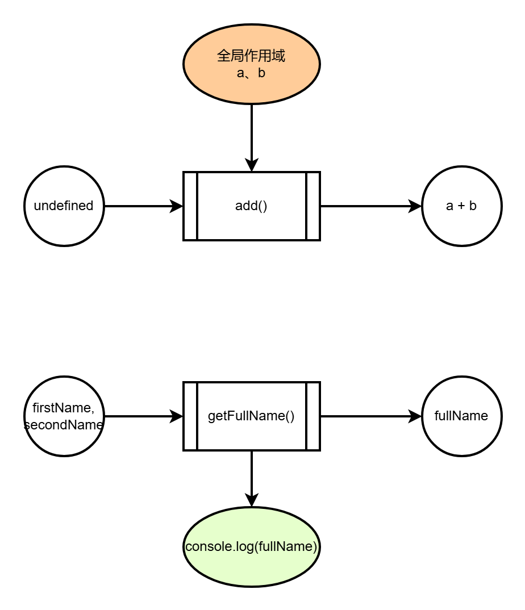
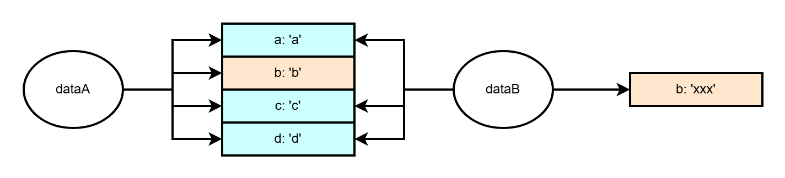
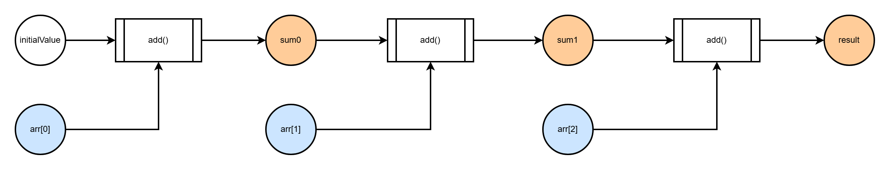
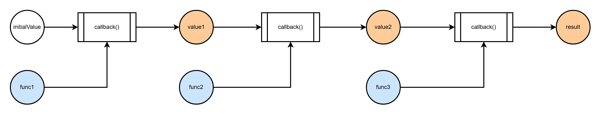
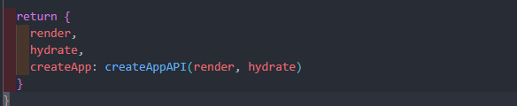
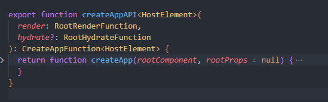

# Javascript 中的函数式编程

函数式编程是一种**编程范式**，编程范式可以理解为编程的风格/方式，它决定了我们以一种什么样的方法和规范去组织自己的代码。

js 是多范式的语言：

- 命令式编程
- 面向对象编程
- 函数式编程

接下来我们主要说一下 js 中的函数式编程：

## 函数式编程是什么

> 函数式编程，或称函数程序设计、泛函编程（英语：Functional programming），是一种编程范型，它将电脑运算视为函数运算，并且避免使用程序状态以及可变对象。 ——维基百科

对于 JS 函数式编程而言，主要有以下特征：

- 纯函数
- 函数是一等公民
- 不可变数据

### 纯函数

若一个函数符合以下要求，则它可以被认为是纯函数：

- 相同输入永远会得到相同输出
- 不能有语义上可观察的副作用

函数副作用：当调用函数时，除了返回可能的函数值之外，还对主调用函数产生附加的影响。（比如修改全局变量、触发事件、修改 UI 等）

```js
let a = 10;
let b = 20;

function add() {
  return a + b;
}

function getFullName(firstName, secondName) {
  const fullName = `${firstName} ${secondName}`;
  console.log(fullName);
  return fullName;
}

async function getData(url) {
  const res = await fetch(url);
  return res.json();
}
```

上面的例子中的几个函数都不是纯函数，`add` 函数引用了全局变量，当修改 `a` 和 `b` 的值时，函数返回值可能会改变，`getFullName` 中打印了 fullname，这改变了浏览器的控制台，属于对外部世界的影响，`getData` 发起了 fetch 请求也属于副作用。

**"纯"与"不纯"的本质**

**“纯”的本质——有且仅有【显式数据流】**

“显式”这个概念，它约束的是数据的来源（入参）和出口（返回值）。数据以入参形式传入，这叫【显式输入数据流】。数据以返回值形式输出，这叫【显式输出数据流】。

显式数据流意味着函数除了入参和返回值之外，不以任何其它形式与外界进行数据交换。

**“不纯”的元凶——隐式数据流**



图中的横向数据流表示函数自身的显式数据流动，方向是从入参到出参。纵向数据流则是隐式数据流，代表函数和外界的数据交换。一个纯函数在执行过程中应该只有横向数据流，而不应该有纵向数据流。

上图的两个函数中都有隐式数据流，一个是隐式的输入，一个是隐式的输出。

由此，我们可以把纯函数翻译的再直白一些：

> 纯函数 —— 输入只能够以参数形式传入，输出只能够以返回值形式传递，除了入参和返回值之外，不以任何其他形式和外界进行数据交换的函数。

函数为什么要"纯"？

纯函数解决了两个大问题：**不确定性**和**副作用**。纯函数的核心是【计算】

**副作用不是毒药**：对于纯函数来说，副作用毫无疑问是毒药。但对于程序来说，副作用却至关重要，如果没有副作用，我们的程序就无法做到任何交互。所以纯函数的目的不是消灭副作用，而是将计算逻辑和副作用分离，从而提升编码质量和执行效率。

### 函数是一等公民

在编程语言中，函数是一等公民的核心特征是函数**可以被当作变量一样使用**，这就意味着：

- 可以被当作参数传递给其他函数
- 可以作为另一个函数的返回值
- 可以被赋值给一个变量

下面的代码展示了 js 中函数的各种用法：

```js
// 赋值给一个变量
const print = () => {
  console.log('hello world');
};

// 作为参数传递
function trigger(callback) {
  callback();
}

// 函数作为另一个函数的返回值
function add(a) {
  return b => {
    return a + b;
  };
}
const addONe = add(1);
const value = addOne(2);
```

"一等公民"的本质：JS 函数是可执行的对象

通过上面的例子，我们可以看到 js 的函数的各个用法，本质上是因为它不仅仅是个函数，它还是个对象。

### 不可变数据

js 中数据类型分为值类型和引用类型，所有值类型的数据都是不可变数据，而引用类型在引用本身不变的情况下，引用所指向的内容是可以改变的

```js
let a = 1;
let b = a;

a === b; // true
b = 2;
a === b; // false

const a = {
  name: 'a',
};
const b = a;

a === b; // true
b.name = 'b';
a === b; // true
```

可变数据会导致的问题

```js{4}
const a = { name: 'a' };

function change(a) {
  const b = a;
  b.name = 'b';
  return b;
}

const b = change(a);
```

上面代码中的 `const b = a;` 本意上是想创建一个和 `a` 的副本，但实际上仅仅是把引用赋值给了 `b`，这就导致当我们修改 `b.name` 时会同步影响到 `a`，产生预期外的错误。

使用可变数据会导致以下问题：

- 使函数的行为变得难以预测
- 使函数复用成本变高

所以，要想写出好的函数式代码，就需要确保数据的不可变性，而使用不可变数据实践原则就是：使用拷贝，而不是修改，确保外部数据的**只读性**

```js
const a = {
  name: 'a',
};

function change(a) {
  const b = { ...a };
  b.name = 'b';
  return b;
}

// ES2023 引入的数组新方法不改变原数组，而返回一个原数组的拷贝。
Array.prototype.sort-- > Array.prototype.toSorted;
Array.prototype.reverse-- > Array.prototype.toReversed;
Array.prototype.splice-- > Array.prototype.toSpliced;
```

但是无脑使用拷贝，也是会有一些问题：对于状态简单、逻辑轻量的应用来说，拷贝是可行的，但对于数据规模巨大、数据变化频繁的应用来说，拷贝对于性能的消耗是巨大的。如何既要保住拷贝的效果，又避开拷贝的弊端？其实社区已经有现成的解决方案了：`immutable.js`, `immer.js`，如果大家经常使用 react 开发，那么对这两个库应该不陌生。实际上 react 中也处处体现了函数式编程的思想。

```js
import { Map } from 'immutable';

const dataA = Map({
  a: 'a',
  b: 'b',
  c: 'c',
  d: 'd',
});

const dataB = dataA.set({
  b: 'xxx',
});

dataA === dataB; // false
```



上面的示例中，`Immutable.js` 仅仅会创建变化的那部分，也就是创建一个新 `b` 给 `dataB`，并且为 `dataB` 对象生成一套指回 `dataA` 对象的指针，从而复用 `dataA` 对象中不变的那 3 个字段。`Immutable.js` 底层是靠 Trie（字典树）来实现持久化数据结构的。

再来看看 `immer.js` 的用法

```js
import { produce } from 'immer';

const baseState = [
  {
    name: 'a',
    age: 18,
  },
  {
    name: 'b',
    age: 20,
  },
];

const recipe = draft => {
  draft.push({ name: 'c', age: 22 });
  draft[1].age = 21;
};

const nextState = produce(baseState, recipe);
```

immer.js 内部通过 proxy 对数据进行代理，通过拦截 `set` 操作来实现对象的懒拷贝。`immer.js` 中的 `produce` 的简单实现可以参考如下代码：

```js
function produce(base, recipe) {
  // 预定义一个 copy 副本
  let copy;

  const baseHandler = {
    set(target, key, value) {
      // 先检查 copy 是否存在，如果不存在，创建 copy
      if (!copy) {
        copy = { ...base };
      }
      // 如果 copy 存在，修改 copy，而不是 base
      copy[key] = value;
      return true;
    },
  };

  const draft = new Proxy(base, baseHandler);
  // 将 draft 作为入参传入 recipe
  recipe(draft);

  // 返回一个被“冻结”的 copy，如果 copy 不存在，表示没有执行写操作，返回 base 即可
  return Object.freeze(copy || base);
}
```

## 高阶函数

高阶函数：至少满足以下条件之一的函数

- 接受一个或多个函数作为输入
- 输出一个或多个函数

我们看如下代码：

```js
// 对数组中的每一项 +1
function arrAdd1(arr) {
  const newArr = [];
  for (let i = 0; i < arr.length; i++) {
    newArr.push(arr[i] + 1);
  }
  return newArr;
}

// 对数组中的每一项 *2
function arrMulti2(arr) {
  const newArr = [];
  for (let i = 0; i < arr.length; i++) {
    newArr.push(arr[i] * 2);
  }
  return newArr;
}

// 对数组中的每一项 /2
function arrDivide2(arr) {
  const newArr = [];
  for (let i = 0; i < arr.length; i++) {
    newArr.push(arr[i] / 2);
  }
  return newArr;
}
```

上面的三个函数分别实现了对数组的每一项进行 +1，\*2，/2 的操作。单独看这些函数的实现是没问题，但是如果把它们放在一起看，代码的设计就有问题了，违背了一个原则，DRY 原则：Don't repeat yourself。

我们可以看到，上面的函数存在很多相同的部分，不同的部分只有对数组的每一项操作不一样。实践 DRY 原则最重要的一点，就是将“变与不变”分离。我们把不变的逻辑提取出来，把变的部分包装成函数函数作为入参传递，代码如下：

```js
function arrCompute(arr, compute) {
  const newArr = [];
  for (let i = 0; i < arr.length; i++) {
    newArr.push(compute(arr[i]));
  }
  return newArr;
}

function add1(num) {
  return num + 1;
}

function multi2(num) {
  return num * 2;
}

function divide2(num) {
  return num / 2;
}

const arr = [1, 2, 3, 4];
arrCompute(arr, add1);
arrCompute(arr, multi2);
arrCompute(arr, divide2);
```

这样我们以一种更简洁、更优美的姿势，实现了同样的功能。其中的 `arrCompute` 函数就是一个高阶函数。这也是使用高阶函数的好处，使我们的代码更加优雅，同时拥有更好的可读性、可复用性。

### Reduce

reduce 是一个高阶函数，同时也是函数式编程中的重要工具。

在 JS 中，基于 reduce，不仅能够推导出其他数组方法，更能够推导出函数组合过程，我们看如下代码：

```js
const arr = [1, 2, 3];
const initialValue = 0;
const add = (prev, cur) => prev + cur;
const sum = arr.reduce(add, initialValue);
```

上面代码的执行过程如下：

1. 执行回调函数 `add()`，入参为`(initialValue, arr[0])`。这一步的计算结果为记为 `sum0`，`sum0=intialValue + arr[0]`，此时剩余待遍历的数组内容为`[2, 3]`，待遍历元素 2 个。
2. 执行回调函数 `add()`，入参为 `(sum0, arr[1])`。这一步的计算结果记为 `sum1`，`sum1 = sum0 + arr[1]`，此时剩余待遍历的数组内容为 `[3]` ，待遍历元素 1 个。
3. 执行回调函数 `add()`，入参为 `(sum1, arr[2])`，这一步的计算结果记为 `sum2`，`sum2 = sum1 + arr[2]`，此时数组中剩余待遍历的元素是 `[]`，遍历结束。
4. 输出 `sum2` 作为 `reduce()` 的执行结果， `sum2` 是一个单一的值。



我们也可以用 `reduce` 推导出 `map`

```js
const arr = [1, 2, 3];

const result = arr.map(item => item + 1);

const initialValue = [];
const addAndPush = (prev, cur) => {
  prev.push(cur + 1);
  return prev;
};
const result = arr.reduce(addAndPush, initialValue);
```

`reduce` 映射了函数组合的思想
通过上面的工作流，可以发现两个特征：

1. `reduce` 的回调函数在做参数组合就 reduce 的单个步骤来说，每一次回调执行，都会吃进 2 个参数，吐出一个结果。把数组中的 n 个元素看作 n 个参数，整个 reduce 的过程就是把 n 个参数逐步组合到一起，最终吐出一个结果的过程。

2. `reduce` 过程构建了一个函数 pipeline。reduce 函数发起的工作流，可以看作是一个函数 pipeline，上一个函数的输出会成为下一个函数的输入。

### 理解声明式数据流：从链式调用到“回调地狱”

在说声明式数据流之前，我们先看下面一段代码：

```js{12-14,16}
const arr = [1, 2, 3, 4, 5, 6, 7, 8];
/**
 * 1. 筛选出数组中大于2的数
 * 2. 将筛选出的数字逐个 * 2
 * 3. 将结果累加
 */

const biggerThan2 = num => num > 2;
const multi2 = num => num * 2;
const add = (prev, cur) => prev + cur;

const filteredArr = arr.filter(biggerThan2);
const multipliedArr = filteredArr.map(multi2);
const sum = multipliedArr.reduce(add, 0);

const sum = arr.filter(biggerThan2).map(multi2).reduce(add, 0);
```

最后一行代码和前面的三行代码实现的功能是一样的，但前面三行代码会产生多余的中间变量，这样就有可能会被修改，同时可读性也不如最后一行的代码。而最后一行通过链式调用的方式避免了中间变量的产生，数据就像是在工厂流水线一般从上一个工序传递到下一个工序，不会暴漏在流水线的外面。这样的代码是声明式的，基于此构建出的数据流，就是声明式的数据流。

实现声明式的数据流，除了借助链式调用，还可以借助函数组合。上面的例子中之所以能够链式调用，是因为它们有一个前提，就是`filter`、`map`、`reduce` 方法都是挂载在 `Array.prototype` 上的，并且它们的返回值都是 `Array`。

但很多独立的函数是无法链式调用的，如果我们想实现声明式的数据流该怎么办呢？这时候就可以采用套娃的方式

```js{13}
function add1(num) {
  return num + 1;
}

function multi2(num) {
  return num * 2;
}

function divide2(num) {
  return num / 2;
}

const sum = divide2(multi2(add1(2)));
```

通过函数的嵌套调用，我们也可以做到声明式的数据流，但仔细看最后一行代码，其实是埋下了巨大的隐患的，那就是回调地狱的问题。上面的例子中只有三个函数的嵌套，一旦函数嵌套数量多了起来，代码的可读性将大打折扣。

那么有没有一种更优雅的方式呢，参考上面 `reduce` 的执行过程，我们其实可以把多个函数放入 `reduce` 中来依次执行，并把上一个函数的执行结果作为下一个函数的入参，这样就能够实现函数的组合了。

借助 reduce 推导函数组合：



基于 `reduce`，可以实现组合函数：

```js
function pipe(...fns) {
  function callback(input, func) {
    return func(input);
  }

  return function (initialValue) {
    return fns.reduce(callback, initialValue);
  };
}

const sum = pipe(add1, multi2, divide2)(2);
```

通过上面通用的 `pipe` 函数，我们将多个函数组合在一起，也像流水线中的工序一样依次执行，同时代码的可读性也更好。**组合**正是函数式编程的核心。

### 柯里化

仔细观察上一步我们实现的 `pipe` 函数，可以发现它是有一个问题的。那就是 `pipe` 返回的函数只能够接收一个参数，对于一些有多个入参的函数想要通过组合的方式来使用应该怎么办呢？那么就可以通过柯里化的方式来解决。

**柯里化是把一个 n 元函数改造为 n 个相互嵌套的一元函数的过程：`fn(a, b, c) --> fn(a)(b)(c)`。**

柯里化解决的最核心的问题有两个，分别是：

- 函数组合链中的多元参数问题，
- 函数逻辑复用的问题

我们看下面一个简单的柯里化函数的实现：

```js
function multiply(x, y) {
  return x * y;
}

function curry(multiFn) {
  return function (x) {
    return function (y) {
      return multiFn(x, y);
    };
  };
}
const curriedMultiply = curry(multiply);

const multiplyTwo = curriedMultiply(2); // 可以缓存一个参数2
multiplyTwo(3);
multiplyTwo(4);
```

通过上面的例子，我们可以发现 `curry` 函数能够将 `multiply` 转换为只接受一个参数的函数，同时还能做到缓存的效果。vue3 的源码中就有柯里化的应用：




可以看到渲染器返回的 `createApp` 函数是通过 `createAppAPI` 返回的，`createAppAPI` 就是一个柯里化函数（偏函数），让 `createApp` 能够在内部使用 `render` 函数。

::: details 柯里化和偏函数的区别
柯里化说的是一个 n 元函数变成 n 个一元函数。

偏函数说的是一个 n 元函数变成一个 m(m < n) 元函数。
:::

上面我们实现的柯里化函数并不够通用，接下来我们看一下通用柯里化函数的实现

```js
function curry(func, arity = func.length) {
  function generateCurried(prevArgs) {
    return function curried(nextArg) {
      const args = [...prevArgs, nextArg];
      if (args.length >= arity) {
        return func(...args);
      } else {
        return generateCurried(args);
      }
    };
  }

  return generateCurried([]);
}
```

通过柯里化，我们就能够解决函数组合链的参数个数问题了

```js
function add(a, b) {
  return a + b;
}

function multiply(a, b, c) {
  return a * b * c;
}

function divide(a, b) {
  return a / b;
}

const curriedAdd = curry(add);
const curriedMultiply = curry(multiply);
const curriedDivide = curry(divide);

const compute = pipe(curriedAdd(1), curriedMultiply(2)(3), curriedDivide(4));
compute(5);
```

## 总结

本文我们介绍了函数式编程的基础概念，以及函数式编程的主要特征：**纯函数**、**函数是一等公民**以及**不可变数据**。这些是函数式编程的基础。然后介绍了高阶函数的概念，以及高阶函数在函数式编程中的具体应用：reduce、函数组合、柯里化。这些都是函数式编程中的常用技巧。
