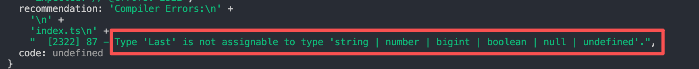
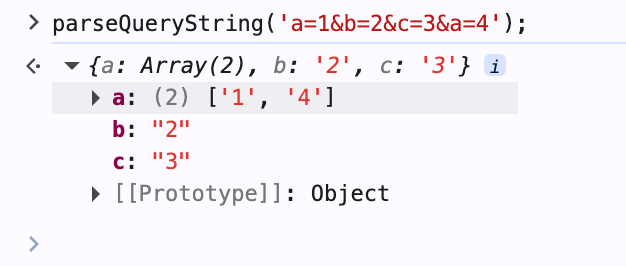

# typescript 类型编程

## typescript 类型编程是什么

typescript 类型编程就是**对类型参数做各种逻辑运算，产生新的类型。** 可以简单的理解为 js 中的函数：

- 入参：泛型参数
- 函数体：逻辑运算
- 返回值：新类型

类型编程初体验：

```ts
type Obj = { name: string; age: number };
type ValueType = string | number;
```

看上面的例子，我们定义了一个类型 `Obj`，是一个索引类型。如果我们想要获取其值的类型，应该怎么做呢？

一方面可以像上面的例子一样，直接手动声明一个类型 `ValueType` 为 `string` 和 `number` 的联合类型。但如果有多个索引类型想要获取其值类型，每个都手动声明一个值类型就显得很麻烦。

像 js 一样，对于一些重复的逻辑我们可以封装为一个函数。对 ts 来说，我们可以通过类型编程来实现一个工具类型用于提取索引类型的值类型，这样我们就可以不用对每个索引类型都手动声明一个值类型了。可以通过下面的工具类型实现:

```ts twoslash
type Obj = { name: string; age: number };
type ValueType = string | number;

type GetObjectValue<T extends Record<string, any>> = T extends {
  [P in keyof T]: infer V;
}
  ? V
  : never;

type Res = GetObjectValue<Obj>;
```

把鼠标移到 `Res` 上面，就可以看到 `Res` 的类型为 `string | number`。

::: tip
本文的 ts 代码，可以通过鼠标悬停来查看其类型信息
:::

上面的 `GetObjectValue` 就是一个工具类型。通过 ts 类型编程的语法我们可以实现各种类型。其实 ts 类型编程是有一些固定的套路的，接下来我们一个个的学习

## typescript 类型系统中的类型运算

### 条件：`extends ? :`

可以类比为 js 中的三元表达式，如果一个类型兼容 `extends` 后的类型，那么结果为 `?` 后的类型，否则为 `:` 后的类型。看下面的例子：

```ts twoslash
type IsTrue<T> = T extends true ? 'true' : 'false';

type Res1 = IsTrue<true>;
type Res2 = IsTrue<false>;
```

### 推导：`infer`

用于提取类型，下面的例子是提取一个数组中第一个元素的类型

```ts twoslash
type GetFirst<T extends unknown[]> = T extends [infer First, ...infer Rest] ? First : never;
type Arr = ['1', '2', '3'];

type Res = GetFirst<Arr>;
```

### 联合：`|`

联合类型（Union）类似 js 里的或运算符 |，但是作用于类型，代表类型可以是几个类型之一。

```ts twoslash
type Union = 1 | 2 | 3;
```

### 交叉：`&`

交叉类型（Intersection）类似 js 中的与运算符 &，但是作用于类型，代表对类型做合并。

```ts twoslash
type Obj = { a: number } & { b: string };

type Res = { a: number; b: string } extends Obj ? true : false;
```

需要注意的是，只有相同的类型可以合并，不同的类型取交叉类型是 `never`

```ts twoslash
type Res = 111 & 'aaa'; // 数字和字符串交叉后是 never，因为没有类型既可以是数字和字符串
```

### 类型映射

用于操作对象类型，主要是以下语法：

- 索引查询：`keyof T`
- 索引访问：`T[P]`
- 遍历联合类型：`in`，一般常用于索引类型键的遍历
- 重映射：`as`，可以在索引键的遍历中对键类型做一些变化

```ts twoslash
type Clone<T extends Record<string, any>> = {
  [P in keyof T]: T[P];
};
type Obj = { name: string; age: number };
type CloneObj = Clone<Obj>;

type GetNameType<T extends Record<string, any>> = {
  [P in keyof T as P extends 'name' ? P : never]: T[P];
};
type Res = GetNameType<Obj>;
type MapObj<T extends Record<string, any>> = {
  [P in keyof T as `#${P & string}`]: T[P];
};
type Res2 = MapObj<Obj>;
```

ts 的类型编程基本上就是上面介绍的语法的组合，接下来我们看一下 ts 类型编程中的具体套路

## 模式匹配做提取

通过 `extends` 一个模式类型，把需要提取的部分放到通过 `infer` 声明的局部变量中，后面就可以拿到这个局部变量的类型做各种处理，我们看几个例子

```ts twoslash
// 获取数组第一个元素
type GetArrFirst<Arr extends unknown[]> = Arr extends [infer First, ...infer Rest] ? First : never;
type Res1 = GetArrFirst<[1, 2, 3]>;

// 判断字符串是否以某个值开头
type StartsWith<Str extends string, V extends string> = Str extends `${V}${string}` ? true : false;
type Res2 = StartsWith<'hello world', 'hello'>;
type Res3 = StartsWith<'hello world', 'hihihi'>;

// 字符串替换
type Replace<
  Str extends string,
  From extends string,
  To extends string,
> = Str extends `${infer Prefix}${From}${infer Suffix}` ? `${Prefix}${To}${Suffix}` : Str;
type Res4 = Replace<'hello world', 'world', 'ts'>;

// 获取函数参数类型
type GetParamType<F extends Function> = F extends (...args: infer P) => any ? P : never;
type Res5 = GetParamType<(name: string, age: number) => void>;

// 获取函数返回值类型
type GetReturnType<F extends Function> = F extends (...args: any[]) => infer R ? R : never;
type Res6 = GetReturnType<() => string>;

// 获取 promise 的值的类型
type GetPromiseValue<T extends Promise<unknown>> = T extends Promise<infer V> ? V : never;
type Res7 = GetPromiseValue<Promise<'aaa'>>;

// 获取对象 name 属性的类型
type GetObjName<T> = T extends { name: infer V } ? V : never;
type Res8 = GetObjName<{ name: string }>;
```

## 重新构造做变换

和模式匹配比较像，但重新构造主要用于基于泛型参数构造出新的类型，模式匹配往往用于提取出泛型参数中的某一部分。下面我们看几个例子：

```ts twoslash
type Tuple1 = [1, 2];
type Tuple2 = ['a', 'b'];
type Res = [[1, 'a'], [2, 'b']];

// 将两个数组元素两两组合
type Zip<T1 extends unknown[], T2 extends unknown[]> = T1 extends [infer F1, ...infer Rest1]
  ? T2 extends [infer F2, ...infer Rest2]
    ? [[F1, F2], ...Zip<Rest1, Rest2>]
    : []
  : [];
type Res1 = Zip<Tuple1, Tuple2>;
type Res2 = Zip<['aaa', 'bbb', 'ccc'], [111, 222, 333]>;

// 将字符串转换为驼峰写法
type CamelCase<Str extends string> = Str extends `${infer Left}_${infer Right}${infer Rest}`
  ? `${Left}${Uppercase<Right>}${CamelCase<Rest>}`
  : Str;
type S = 'hello_ts_slidev';
type Res3 = CamelCase<S>;

// 给函数添加参数
type AppendArg<F extends Function, Arg> = F extends (...args: infer Args) => infer R
  ? (...args: [...Args, Arg]) => R
  : never;
type Res4 = AppendArg<(name: string) => void, number>;

// 将索引类型的键名改为大写
type UppercaseKey<T extends Record<string, any>> = {
  [P in keyof T as Uppercase<P & string>]: T[P];
};
type Res5 = UppercaseKey<{ name: string; age: number }>;

// 只读
type ToReadonly<T> = {
  readonly [P in keyof T]: T[P];
};
type Res6 = ToReadonly<{ name: string; age: number }>;

// 可选
type ToPartial<T> = {
  [P in keyof T]?: T[P];
};
type Res7 = ToPartial<{ name: string; age: number }>;

// 必选
type ToRequired<T> = {
  [P in keyof T]-?: T[P];
};
type Res8 = ToRequired<{ name?: string; age?: number }>;

// 按值类型过滤
type FilterByValueType<T extends Record<string, any>, V> = {
  [P in keyof T as T[P] extends V ? P : never]: T[P];
};
type Obj = { name: string; age: number; hobby: string[] };
type Res9 = FilterByValueType<Obj, string | number>;
```

## 递归复用做循环

通过类型提取和重新构造，我们已经能够写出很多类型编程逻辑了，但是有时候提取或构造一些数组元素个数不确定、字符串长度不确定、对象层数不确定的类型时应该怎么办呢？其实前面的例子中已经涉及到了一些，就是使用递归。

typescript 类型系统不支持循环，但支持递归。当处理数量（个数、长度、层数）不固定的类型的时候，可以先只处理一个类型，然后递归调用自身处理下一个类型，直到所有的类型都处理完了（结束条件），就完成了不确定数量的类型编程。

下面我们看几个递归的例子：

```ts twoslash
// 提取不确定层数的 Promise 中的 value 类型
type DeepPromiseValueType<T> = T extends Promise<infer V> ? DeepPromiseValueType<V> : T;
type P1 = Promise<Promise<Promise<Promise<{ code: number; data: any }>>>>;
type Res1 = DeepPromiseValueType<P1>;

// 反转数组
type Arr = [1, 2, 3, 4, 5];
type ReverseArr<T extends unknown[]> = T extends [infer First, ...infer Rest]
  ? [...ReverseArr<Rest>, First]
  : T;
type Res2 = ReverseArr<Arr>; // [5, 4 ,3, 2, 1];

// 根据 Length 构建数组。这里用到了把类型参数作为结果返回的技巧
type BuildArr<
  Length extends number,
  Ele = unknown,
  Arr extends unknown[] = [],
> = Arr['length'] extends Length ? Arr : BuildArr<Length, Ele, [...Arr, Ele]>;
type Res3 = BuildArr<5>;

// 字符串转换成其字符的联合类型
type StringToUnion<Str extends string> = Str extends `${infer First}${infer Rest}`
  ? First | StringToUnion<Rest>
  : never;
type Res4 = StringToUnion<'hello'>;

// deep readonly
type DeepReadonly<Obj extends Record<string, any>> = {
  readonly [Key in keyof Obj]: Obj[Key] extends Record<string, any>
    ? DeepReadonly<Obj[Key]>
    : Obj[Key];
};
interface Obj {
  name: string;
  age: number;
  friend: {
    name: string;
    foo: {
      a: number;
    };
  };
}
type Res5 = DeepReadonly<Obj>;
```

## 数组长度做计数

typescript类型系统中没有加减乘除运算符，想要做一些数值相关的计算可以通过**构造数组然后取length**来完成

```ts twoslash
// 构造一个长度为 Length 的数组
type BuildArr<
  Length extends number,
  Ele = unknown,
  Arr extends unknown[] = [],
> = Arr['length'] extends Length ? Arr : BuildArr<Length, Ele, [...Arr, unknown]>;

// 加
type Add<N1 extends number, N2 extends number> = [...BuildArr<N1>, ...BuildArr<N2>]['length'];
type Res1 = Add<10, 5>;

// 减
type Subtract<N1 extends number, N2 extends number> = [...BuildArr<N1>] extends [
  ...BuildArr<N2>,
  ...infer Rest,
]
  ? Rest['length']
  : never;
type Res2 = Subtract<10, 5>;

// 乘：N2 个 N1 相加
type Multiple<N1 extends number, N2 extends number, Res extends unknown[] = []> = N2 extends 0
  ? Res['length']
  : Multiple<N1, Subtract<N2, 1>, [...Res, ...BuildArr<N1>]>;
type Res3 = Multiple<10, 5>;

// 除：N1 每次减去 N2，直到 N1 为 0
type Divide<N1 extends number, N2 extends number, Res extends unknown[] = []> = N1 extends 0
  ? Res['length']
  : Divide<Subtract<N1, N2>, N2, [...Res, unknown]>;
type Res4 = Divide<10, 5>;

function fibonacci(n: number) {
  let prev = 1;
  let cur = 1;
  for (let i = 2; i < n; i++) {
    const tmp = prev;
    prev = cur;
    cur = cur + tmp;
  }
  return cur;
}

// ts 实现斐波那契数列
type FiboLoop<
  PrevArr extends unknown[] = [],
  CurArr extends unknown[] = [],
  IndexArr extends unknown[] = [],
  Num extends number = 1,
> = IndexArr['length'] extends Num
  ? CurArr['length']
  : FiboLoop<CurArr, [...PrevArr, ...CurArr], [...IndexArr, unknown], Num>;

type Fibonacci<N extends number> = N extends 1
  ? 1
  : N extends 2
    ? 1
    : FiboLoop<[any], [any], [any, any], N>;
// 1, 1, 2, 3, 5, 8, 13, 21, 34
type Res5 = Fibonacci<9>;
```

## 联合分散可简化

当类型参数为联合类型，并且在条件类型左边直接引用该类型参数的时候，TypeScript 会把每一个元素单独传入来做类型运算，最后再合并成联合类型，这种语法叫做分布式条件类型。

比如有个联合类型如下：

```ts twoslash
type Union = 'a' | 'b' | 'c';
```

如我我们想把其中的 `a` 大写，就可以用这个特性实现：

```ts twoslash
type Union = 'a' | 'b' | 'c';
type UppercaseA<Item extends string> = Item extends 'a' ? Uppercase<Item> : Item;
type Res = UppercaseA<Union>;
```

联合类型遇到字符串时也是一样的处理方式：

```ts twoslash
type Union = 'a' | 'b' | 'c';
type Res = `${Union}~~`;
```

下面我们看更多的例子：

```ts twoslash
// 从联合类型中移除元素
type Exclude<T, U> = T extends U ? never : T;
type Res1 = Exclude<1 | 2 | 3 | 4, 1 | 2>;

type CamelcaseUnion<Item extends string> = Item extends `${infer Left}_${infer Right}${infer Rest}`
  ? `${Left}${Uppercase<Right>}${CamelcaseUnion<Rest>}`
  : Item;
type Res2 = CamelcaseUnion<'hello_ts' | 'hello_js'>;

// 数组转联合类型
type ArrToUnion<Arr extends unknown[]> = Arr[number];
type Res3 = ArrToUnion<['aaa', 'bbb', 'ccc']>;

// BEM
type BEM<
  Block extends string,
  Element extends string[],
  Modifiers extends string[],
> = `${Block}__${Element[number]}--${Modifiers[number]}`;
type Res4 = BEM<'cl', ['button', 'tag'], ['success', 'warning']>;

// 下面的例子可以很明显体现出分布式条件类型，extends 左边的 U 为联合类型的子项，右边的 U 为联合类型
type TestUnion<U, V = U> = U extends U ? { a: U; b: V } : never;
type TestUnionRes = TestUnion<'a' | 'b'>;

// 利用分布式条件类型的特性，可以判断是否是联合类型
type IsUnion<T, V = T> = T extends V ? ([V] extends [T] ? false : true) : never;
type Res5 = IsUnion<1 | 2 | 3>;
type Res6 = IsUnion<1>;
type Res7 = IsUnion<[1]>;

// 组合：'A' | 'B' => 'A' | 'B' | 'AB' | 'BA'
type Combination<A extends string, B extends string> = A | B | `${A}${B}` | `${B}${A}`;
type AllCombination<A extends string, B extends string = A> = A extends A
  ? Combination<A, AllCombination<Exclude<B, A>>>
  : never;
type Res8 = AllCombination<'A' | 'B'>;
type Res9 = AllCombination<'A' | 'B' | 'C'>;
```

## 特殊特性要记清

TypeScript 类型系统中有些类型比较特殊，比如 `any`、`never`和联合类型等。一些类型的判断要根据它的特性来，我们分别看一下这些特性：

### `IsAny`: any 类型与任何类型的交叉都是 any

```ts twoslash
type IsAny<T> = 'a' extends 'b' & T ? true : false;
type Res1 = IsAny<any>;
type Res2 = IsAny<string>;
type Res3 = IsAny<{}>;
```

### `IsNever`: never 作为类型参数在条件类型左边时会直接返回 never

```ts twoslash
type TestNever<T> = T extends never ? true : false;
type T1 = TestNever<never>; // 会直接返回 never
type T2 = TestNever<1>;

// 使用数组包一下
type IsNever<T> = [T] extends [never] ? true : false;
type Res1 = IsNever<1>;
type Res2 = IsNever<'a'>;
type Res3 = IsNever<never>;
```

### `IsTuple`: 元组类型的 length 是数字字面量，而数组的 length 是 number。

```ts twoslash
type Len1 = [1, 2, 3]['length'];
type Len2 = number[]['length'];

type NotEqual<A, B> =
  (<T>() => T extends A ? 1 : 2) extends <T>() => T extends B ? 1 : 2 ? false : true;

// 判断 T 是否是数组，不是直接返回false。如果是则判断 length 属性是否是 number
type IsTuple<T> = T extends [...eles: infer Eles] ? NotEqual<Eles['length'], number> : false;
type Res1 = IsTuple<[1, 2, 3]>;
type Res2 = IsTuple<string[]>;
type Res3 = IsTuple<'a'>;
```

### `UnionToIntersection`: 联合类型转交叉类型

类型之间是有父子关系的，更具体的那个是子类型，比如 `A` 和 `B` 的交叉类型 `A & B` 就是联合类型 `A | B` 的子类型

如果允许父类型赋值给子类型，就叫做**逆变**

如果允许子类型赋值给父类型，就叫做**协变**

在 TypeScript 中函数参数是有逆变的性质的，也就是如果参数可能是多个类型，参数会变成他们的交叉类型。所以联合类型转交叉可以利用函数参数的逆变性质实现

```ts twoslash
type UnionToIntersection<U> = (U extends U ? (x: U) => unknown : never) extends (
  x: infer R
) => unknown
  ? R
  : never;

type A = { name: string } | { age: number };
type Res = UnionToIntersection<A>;
```

类型参数 U 是要转换的联合类型。`U extends U` 是为了触发联合类型的分布式条件类型的性质，让每个类型单独传入做计算，最后合并。利用 `U` 做为参数构造函数 `(x: U) => unknown`，通过模式匹配取参数的类型 `(x: infer R) => unknown`，函数的参数是联合类型，而他们的交叉类型是联合类型的子类型，利用函数参数的逆变性质，结果就是交叉类型。

### `GetOptional`: 可选索引的值为 undefined 和值类型的联合类型

```ts twoslash
type Obj = { name: string; age?: number | undefined };

type GetOptional<T extends Record<string, any>> = {
  [P in keyof T as {} extends Pick<T, P> ? P : never]: T[P];
};
type Res = GetOptional<Obj>;
```

上面例子中的 `{} extends Pick<T, P>` 可以过滤出可选索引

### `as const`: 默认推导出来的不是字面量类型，加上 as const 可以推导出字面量类型，但带有 readonly 修饰

```ts twoslash
const Person1 = { name: '张三', age: 20 };
const Person2 = { name: '张三', age: 20 } as const;
```

### `infer extends`

我们知道 `infer` 可以通过模式匹配来提取类型中的一部分，比如提取元组最后一个元素的类型

```ts twoslash
type Last<T extends unknown[]> = T extends [...infer Rest, infer Ele] ? Ele : never;

type Res = Last<[1, 2, 3]>;
```

再比如提取函数的返回值类型：

```ts twoslash
type ReturnType<F extends Function> = F extends (...args: unknown[]) => infer R ? R : never;
type Res = ReturnType<() => string>;
```

infer 的模式匹配用法还是挺好理解的，但是 infer 又一个问题，看下面的例子：

```ts
type TestLast<T extends string[]> = 
  T extends [...infer Rest, infer Last] ? `最后一个元素是：${Last}` : never;
```

可以发现，编辑器报错了:



为什么会报错呢，虽然限制了 `T extends string[]`, 但在 `infer Last` 这个推断过程中，TypeScript 默认将 `Last` 推断为一个泛型类型参数，被视为 `unknown` 类型，所以 `Last` 和 `string` 类型不兼容，导致报错。

解决方法也很简单，我们可以再加一层条件类型判断：

```ts twoslash

type TestLast<T extends string[]> = 
  T extends [...infer Rest, infer Last] 
    ? Last extends string 
      ? `最后一个元素是：${Last}` 
      : never
    : never;
type Res = TestLast<['a', 'b', 'c']>;
```

但这样也太麻烦了，我们明明知道这里就是 `string`，却还要再 `xxx extends string` 来转换一次。在 TypeScript 4.7 中，新增了 `infer extends` 的语法，可以简化上面的代码，现在可以这样写：

```ts twoslash
type TestLast<T extends string[]> = 
  T extends [...infer Rest, infer Last extends string] 
    ? `最后一个元素是：${Last}` 
    : never;
type Res = TestLast<['a', 'b', 'c']>;
```

**infer 的时候加上 extends 来约束推导的类型，这样推导出的就不再是 unknown 了，而是约束的类型**

下面我们看几个 `infer extends` 的例子：

```ts twoslash
// 提取数字字符串中的数字类型
type ExtractNumber<S extends string> = 
  S extends `${infer N extends number}` ? N : S;
type Res = ExtractNumber<'123'>;

// 提取枚举值的类型
enum E {
  a = 1,
  b = 2,
  c = 'aaa',
  d = 'bbb',
}
type EValue = `${E}`;
type Res2 = ExtractNumber<`${E}`>;
```

## TypeScript 内置的高级类型

前面我们说了 ts 类型编程的一些技巧，通过这些技巧我们可以自己实现很多类型，但实际上一些常见的类型不需要我们自己写，ts 内置了很多高级类型，下面我们看看 ts 内置的一些高级类型：

### Parameters：获取函数参数类型

```ts twoslash
type Parameters<T extends (...args: any) => any> = 
  T extends (...args: infer P) => any ? P : never;

type Res = Parameters<(name: string, age: number) => void>;
```

### ReturnType：获取函数返回值类型

```ts twoslash
type ReturnType<T extends (...args: any) => any> = 
  T extends (...args: any) => infer R ? R : any;

type Res = ReturnType<() => string>;
```

### ConstructorParameters：获取构造函数参数类型

```ts twoslash
type ConstructorParameters<T extends abstract new (...args: any) => any> = 
  T extends abstract new (...args: infer P) => any ? P : never;

type Res = ConstructorParameters<new (name: string, age: number) => void>;
```

### InstanceType：获取构造函数返回值类型

```ts twoslash
type InstanceType<T extends abstract new (...args: any) => any> = 
  T extends abstract new (...args: any) => infer R ? R : any;

interface Person {
  name: string;
  age: number;
}
type Res = InstanceType<new (name: string, age: number) => Person>;
```

### ThisParameter：获取函数的 this 参数类型

```ts twoslash
type ThisParameterType<T> = T extends (this: infer U, ...args: any[]) => any ? U : unknown;

type Res = ThisParameterType<(this: { name: string }, age: number) => void>;
```

### OmitThisParameter：去除函数的 this 参数类型

```ts twoslash
type OmitThisParameter<T> = 
  unknown extends ThisParameterType<T> 
    ? T 
    : T extends (...args: infer A) => infer R 
      ? (...args: A) => R 
      : T;

type Res = OmitThisParameter<(this: { name: string }, age: number) => void>;
```

### Partial：将类型中的所有属性变为可选

```ts twoslash
type Partial<T> = {
  [P in keyof T]?: T[P];
};

type Obj = { name: string; age: number };
type Res = Partial<Obj>;
```

### Required：将类型中的所有属性变为必选

```ts twoslash
type Required<T> = {
  [P in keyof T]-?: T[P];
};

type Obj = { name?: string; age?: number };
type Res = Required<Obj>;
```

### Readonly：将类型中的所有属性变为只读

```ts twoslash
type Readonly<T> = {
  readonly [P in keyof T]: T[P];
};

type Obj = { name: string; age: number };
type Res = Readonly<Obj>;
```

### Pick：从类型中取出指定的属性

```ts twoslash
type Pick<T, K extends keyof T> = {
  [P in K]: T[P];
};

type Obj = { name: string; age: number };
type Res = Pick<Obj, 'name'>;
```

### Record：创建索引类型

```ts twoslash
type Record<K extends keyof any, T> = {
  [P in K]: T;
};

type Res = Record<'a' | 'b' | 'c', number>;
```

### Exclude：排除指定的类型

```ts twoslash
type Exclude<T, U> = T extends U ? never : T;

type Res = Exclude<'a' | 'b' | 'c', 'a'>;
```

### Extract：提取指定的类型

```ts twoslash
type Extract<T, U> = T extends U ? T : never;

type Res = Extract<'a' | 'b' | 'c', 'a'>;
```

### Omit：排除指定的属性

```ts twoslash
type Omit<T, K extends keyof any> = Pick<T, Exclude<keyof T, K>>;

type Obj = { name: string; age: number };
type Res = Omit<Obj, 'name'>;
```

### Awaited：获取 Promise 的返回值类型

```ts twoslash
type Awaited<T> = 
  T extends null | undefined 
    ? T 
    : T extends object & { then(onfulfilled: infer F, ...args: infer _): any } 
      ? F extends (value: infer V, ...args: infer _) => any 
        ? Awaited<V> 
        : never 
      : T

type Res = Awaited<Promise<Promise<string>>>;
```

### NonNullable：排除 null 和 undefined

```ts twoslash
type NonNullable<T> = T extends null | undefined ? never : T;

type Res = NonNullable<string | number | null | undefined>;
```

## ParseQueryString

上面我们学习了 typescript 类型编程的技巧，下面我们通过一个综合案例来练习一下：

首先，我们实现一个 js 函数，用于对 url 中的 querystring 进行解析，如果有同名的参数就合并：

```js
function parseQueryString(querystring) {
  if (!querystring) return {};
  const params = {};
  querystring.split('&').forEach((item) => {
    const [key, value] = item.split('=');
    if (params[key]) {
      if (Array.isArray(params[key])) {
        params[key].push(value);
      } else {
        params[key] = [params[key], value];
      }
    } else {
      params[key] = value;
    }
  });
  return params;
}

const res = parseQueryString('a=1&b=2&c=3&a=4');
```



如果要给这个函数添加类型，大部分人可能会这么加：

```ts
function parseQueryString(querystring: string): Record<string, any>{
  if (!querystring) return {};
  const params: { [key: string]: string } = {};
  querystring.split('&').forEach((item) => {
    const [key, value] = item.split('=');
    if (params[key]) {
      if (Array.isArray(params[key])) {
        params[key].push(value);
      } else {
        params[key] = [params[key], value];
      }
    } else {
      params[key] = value;
    }
  });
  return params;
}
```

但如果这么写的话，返回的对象就不能提示出有哪些属性，也不能提示出属性的类型，所以我们可以用 typescript 类型编程来实现这个函数，实现思路我们可以按照 js 函数的逻辑来写：

1. 将字符串按照 & 分割。
2. 将分割后的字符串按照 = 分割。
3. 解析每对 key 和 value 为对象，并将结果合并。
4. 多个对象中如果有 key 相同的情况，需要将其值合并成数组。

接下来我们实现 `ParseQueryString` 这个类型：

```ts twoslash
// 通过模式匹配 `key=value` 提取 key 和 value 并构造成对象
type ParseParam<S extends string> = 
  S extends `${infer K}=${infer V}` ? { [P in K]: V } : Record<string, any>;

// 对值进行合并
type MergeValues<One, Other> = 
  One extends Other 
    ? One // 值相同取一个就行
    : Other extends unknown[] 
      ? [One, ...Other] // 值不同合并成数组
      : [One, Other]; // 值不同合并成数组

// 合并对象
type MergeParams<OneParam extends Record<string, any>, OtherParam extends Record<string, any>> = {
  [K in keyof OneParam | keyof OtherParam]: // K 为两个对象中所有的key
    K extends keyof OneParam 
      ? K extends keyof OtherParam // 说明 K 在两个对象中都有，需要合并其值为数组
        ? MergeValues<OneParam[K], OtherParam[K]> // K 在存在多个值时进行合并
        : OneParam[K] // K 只在 OneParam 中
      : K extends keyof OtherParam 
        ? OtherParam[K] // K 只在 OtherParam 中
        : never;
}

type ParseQueryString<S extends string> = 
  S extends `${infer Param}&${infer Rest}` // 按 & 分割
    ? MergeParams<ParseParam<Param>, ParseQueryString<Rest>> // 先将每个 key=value 解析成对象，然后进行合并
    : ParseParam<S>;

type Res = ParseQueryString<'a=1&b=2&c=3&a=4'>;
```

## 学习资料

- 官方文档：[https://www.typescriptlang.org/docs/handbook/intro.html](https://www.typescriptlang.org/docs/handbook/intro.html)

- type-challenges: [https://github.com/type-challenges/type-challenges](https://github.com/type-challenges/type-challenges)

- TypeScript 类型体操通关秘籍: [https://juejin.cn/book/7047524421182947366](https://juejin.cn/book/7047524421182947366)

- 深入理解 TypeScript: [https://jkchao.github.io/typescript-book-chinese](https://jkchao.github.io/typescript-book-chinese/)
