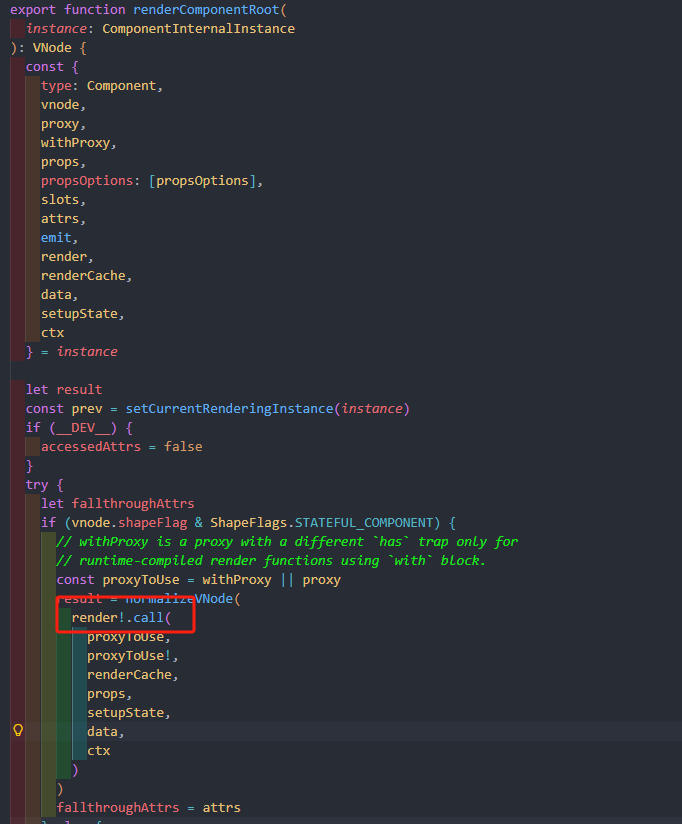
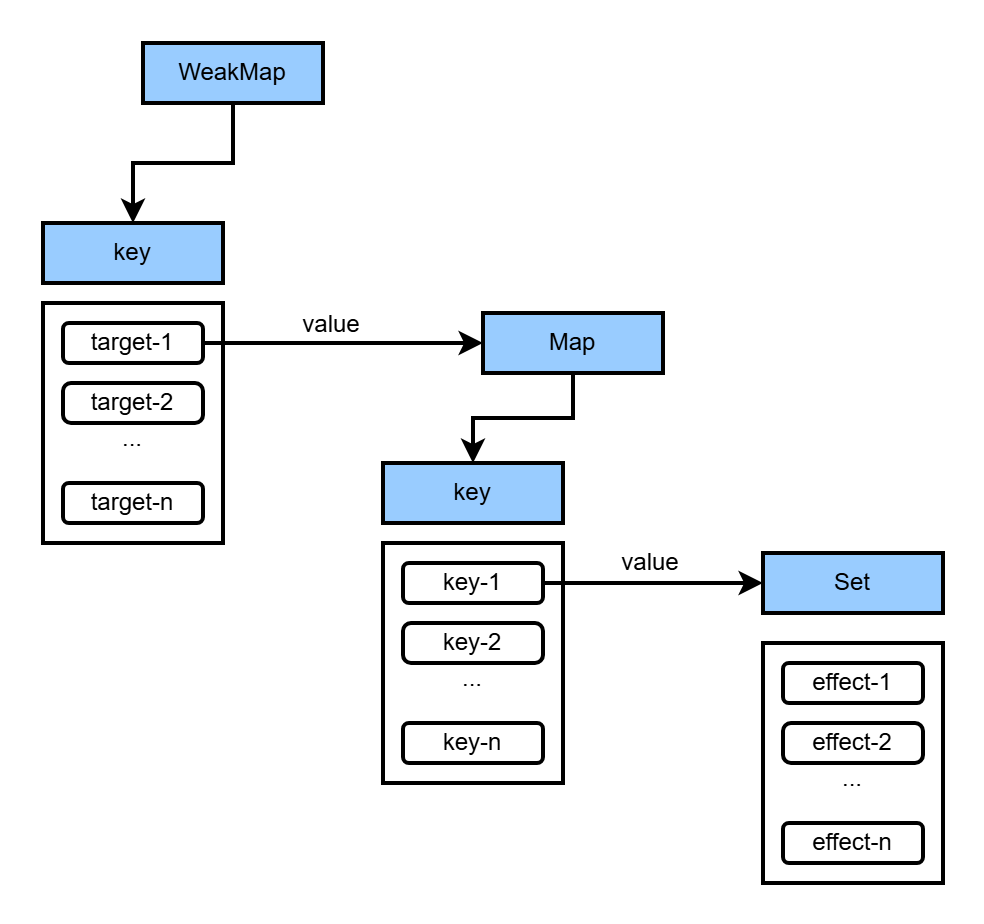
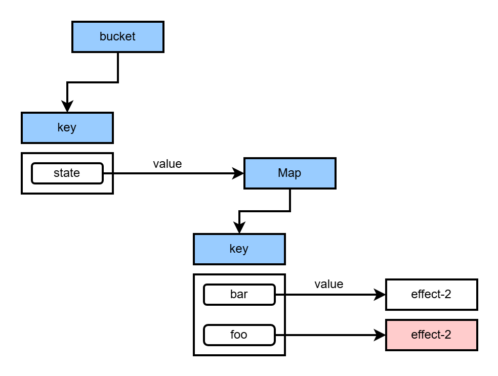

# Vue 响应式系统原理

vue 是一个数据驱动的框架，当我们修改数据时，视图会自动更新。其核心就是 vue 内部的响应式系统，下面我们就看一下 vue 响应式系统的原理以及实现一个响应式系统。

## 响应式系统案例分析

我们先看一下下面这个示例，体验一下 vue 的响应式系统是如何工作的：

<script setup>import CountDemo from './examples/CountDemo.vue'</script>
<CountDemo />

<<< ./examples/CountDemo.vue{4,6,12}

观察上面的代码，可以看到声明了一个响应式数据 `state`，然后在模板中读取了 `state` 的 `count` 属性，点击按钮时会设置 `state.count` 的值。

在 vue 的源码中，上述的组件模板会被 vue 编译为 `render` 函数，可以通过 [https://template-explorer.vuejs.org/](https://template-explorer.vuejs.org/) 查看模板编译后的代码。上面示例中的模板编译后的 `render` 函数如下：

```javascript
export function render(_ctx, _cache, $props, $setup, $data, $options) {
  return (
    _openBlock(),
    _createElementBlock('template', null, [
      _createElementVNode('div', { class: 'example-container' }, [
        _createElementVNode(
          'p',
          { class: 'm-0' },
          'count is: ' + _toDisplayString(_ctx.state.count),
          1 /* TEXT */
        ),
        _createElementVNode(
          'button',
          {
            class: 'example-button',
            onClick: _ctx.handleClick,
          },
          'add count',
          8 /* PROPS */,
          ['onClick']
        ),
      ]),
    ])
  );
}
```

模板编译后的结果会作为组件的 `render` 函数，在组件的渲染过程中，组件的 `render` 函数会在 `effect` 函数中执行。




忽略渲染器的代码，上述示例可以简化为如下代码：

```javascript
const state = reactive({ count: 0 });
const handleClick = () => {
  state.count++;
};

effect(() => {
  const p = document.createElement('p');
  p.textContent = 'count is: ' + state.count;
});
```

可以看到，在 `effect` 中读取了响应式数据的属性，未来如果修改了 count，只需要重新执行传入到 `effect` 中传入的副作用函数就能够更新页面了，所以除了响应式数据本身，还要有 effect 函数才能够实现完整的响应式系统。由此，我们可以得到 vue 响应式系统中的两个核心：

- 副作用函数：`effect`
- 响应式数据：`reactive`

接下来，我们从这两部分开始，手动实现一个响应式系统。

## 实现一个响应式系统

### 副作用函数和响应式数据

副作用函数指的是会产生副作用的函数，**副作用**（[https://zh.wikipedia.org/wiki/%E5%89%AF%E4%BD%9C%E7%94%A8\_(%E8%AE%A1%E7%AE%97%E6%9C%BA%E7%A7%91%E5%AD%A6)](<https://zh.wikipedia.org/wiki/%E5%89%AF%E4%BD%9C%E7%94%A8_(%E8%AE%A1%E7%AE%97%E6%9C%BA%E7%A7%91%E5%AD%A6)>)）是函数式编程中重要的概念，指当调用函数时，除了返回可能的函数值之外，还对主调用函数产生附加的影响。例如修改全局变量（函数外的变量），修改参数，向主调方的终端、管道输出字符或改变外部存储信息等。拿上面的例子来说，修改了页面中 `p` 元素的内容就是一个副作用。

响应式数据可以简单理解为，在一个副作用函数中读取了一个数据的属性后，修改这个属性，副作用函数会重新执行，那么这个数据就可以视为响应式数据。上面的例子中，`state` 就是一个响应式数据。

理解了副作用函数和响应式数据的基本概念后，就可以开始实现一个简单的响应式系统了。

- `effect`: 接收一个副作用函数作为参数，然后执行这个函数，同时为了响应式数据变化之后副作用函数能够重新执行，我们需要保存传入的副作用函数。
- 响应式数据：在读取属性时关联副作用函数，同时在修改属性后能够取出关联的副作用函数重新执行。

```javascript
const bucket = new Set(); // 用于存储副作用函数
let activeEffect;

function effect(fn) {
  activeEffect = fn;
  fn();
}

function reactive(target) {
  return new Proxy(target, {
    get(target, key, receiver) {
      // 如果在副作用函数中读取了响应式数据，则将当前副作用存储到 bucket 中
      if (activeEffect) {
        bucket.add(activeEffect);
      }
      return Reflect.get(target, key, receiver);
    },
    set(target, key, newValue, receiver) {
      const res = Reflect.set(target, key, newValue, receiver);
      // 修改响应式数据时，取出副作用函数重新执行
      bucket.forEach(effect => effect());
      return res;
    },
  });
}
```

上面我们实现了最简单的响应式系统，但是还存在一些问题，上述代码只是简单的在读取属性时将副作用函数添加到 `bucket` 中，在修改属性时取出所有的副作用函数重新执行，这样当我们修改响应式数据的任意属性时，都会重新执行副作用函数:

```javascript
const state = reactive({ foo: 1 });
effect(() => {
  console.log('effect run', state.foo);
});

state.bar = 2; // 副作用函数会重新执行，尽管副作用函数中只读取了 foo 属性
```

上面的例子中，在 `effect` 函数中只读取的响应式数据的 foo 属性，但在修改 state.bar 的时候，副作用函数任然会重新执行，但这其实是没必要的。所以我们需要在**副作用函数**、**响应式数据**、**响应式数据的属性**之间建立正确的联系：

```javascript
const bucket = new WeakMap();
let activeEffect;

function effect(fn) {
  activeEffect = fn;
  fn();
}

function reactive(target) {
  return new Proxy(target, {
    get(target, key, receiver) {
      track(target, key);
      return Reflect.get(target, key, receiver);
    },
    set(target, key, newValue, receiver) {
      const res = Reflect.set(target, key, newValue, receiver);
      trigger(target, key);
      return res;
    },
  });
}

function track(target, key) {
  if (!activeEffect) return; // 没在副作用函数中读取响应式属性，不收集依赖
  let depsMap = bucket.get(target);
  if (!depsMap) {
    bucket.set(target, (depsMap = new Map()));
  }
  let dep = depsMap.get(key);
  if (!dep) {
    depsMap.set(key, (dep = new Set()));
  }
  dep.add(activeEffect);
}

function trigger(target, key) {
  const depsMap = bucket.get(target);
  if (!depsMap) return;
  const deps = depsMap.get(key);
  deps && deps.forEach(effect => effect());
}
```

我们将 `bucket` 改为了 `WeakMap`，其中 key 是原始对象，value 是一个 `Map` 结构，这个 Map 结构的 key 是原始对象中的属性，value 是一个 Set 类型，用于存储一个对象的某个属性所关联的所有副作用函数。在读取属性时通过 `track` 函数在 `target`、`key`、`effect` 之间建立正确的响应式联系，在设置属性时通过 `trigger` 函数只取出和 `target.key` 有关的副作用重新执行。



:::details `bucket` 为什么使用 `WeakMap` 而不是 `Map`
我们在日常开发中，组件是有可能销毁的，使用 `WeakMap` 时，在组件销毁后，其响应式数据就不存在了，`WeakMap` 对其中的键是弱引用的，所以在垃圾回收时也会从 `bucket` 中移除其存储的原始数据和所有的响应式联系。而使用 `Map` 时，即使组件销毁了，由于 `bucket` 还引用着组件的原始数据，导致其不会被垃圾回收，就会造成内存泄漏。
:::

### 完善响应式系统

上面我们已经实现的基本的响应式系统，但还有很多其他的问题。接下来我们一个一个的解决：

#### 分支切换与 cleanup

```javascript
const state = reactive({ text: 'hello word', ok: true });

effect(() => {
  document.body.innerHTML = state.ok ? state.text : 'no';
});

state.ok = false;

setTimeout(() => {
  state.text = 'hello vue';
}, 1000);
```

上面的代码会建立如下的响应式联系：


当执行 `state.ok = false;` 后，`document.body.innerHTML` 的值会变为 `no`，此时我们再修改 `state.text` 也不会影响 `document.body.innerHTML` 的内容同时也没必要再执行副作用函数了。但现在 `bucket` 中任然存储着 `state.text` 所关联的副作用函数，所以副作用函数还是会重新执行，这其实是没有必要的。

为了达到上述的目的，我们需要新增一个清除依赖的功能。可以在每次副作用函数执行执行，将当前副作用函数的所有依赖都清除，然后执行副作用函数时重新收集。这样当上面例子中的 `state.ok` 变为 `false` 时，由于不会读取 `state.text` 就不会建立 `state.text` 与副作用之间的联系。

目前的实现中我们只是在 `dep` 中存储了 `effect`，所以只能通过 `dep` 来清除其中存储的 `effect`，为了在副作用执行之前能够清除依赖，我们需要在 `effect` 中也存储与其关联的 `dep`，建立一个双向的联系，这样就能够通过 `effect` 得到与其关联的 `dep` 然后通过 `dep` 清除 `effect`

```javascript{3,7,11-18,30}
function effect(fn) {
  const effectFn = () => {
    cleanup(effectFn); // 执行副作用函数前先清理关联的 dep
    activeEffect = effectFn;
    fn();
  };
  effectFn.deps = []; // 用于存储 dep，在 dep 和 effect 之间建立双向联系
  effectFn();
}

function cleanup(effect) {
  for (const dep of effect.deps) {
    dep.delete(effect);
    // dep 中没有存储副作用函数时，把 dep 从 Map 中移除
    if (dep.size === 0) dep.cleanup();
  }
  effect.deps.length = 0;
}

function track() {
  if (!activeEffect) return;
  let depsMap = bucket.get(target);
  if (!depsMap) {
    bucket.set(target, (depsMap = new Map()));
  }
  let dep = depsMap.get(key);
  if (!dep) {
    depsMap.set(key, (dep = createDep(() => depsMap.delete(key))));
  }
  dep.add(activeEffect);
  activeEffect.deps.push(deps); // 把 dep 添加到 effect.deps 中
}

function createDep(cleanup) {
  const dep = new Set();
  dep.cleanup = cleanup;
  return dep;
}

function trigger(target, key) {
  const depsMap = bucket.get(target);
  if (!depsMap) return;
  const dep = depsMap.get(key);
  const effectsToRun = new Set(dep);
  effectsToRun.forEach(effect => effect());
}
```

可以看到，我们在 `effectFn` 中添加了 `deps` 属性用于存储关联的 `dep`，在读取响应式依赖时，除了将 `effectFn` 添加到 `dep` 中，也会把 `dep` 添加到 `effectFn.deps` 中建立双向联系，当再次执行副作用函数时会先执行 `cleanup` 把当前副作用函数的所有依赖全部清除，然后再执行副作用函数重新收集依赖，这样就能避免遗留的副作用函数了。

#### effect 的嵌套问题

`effect` 是可以嵌套的，在日常开发中我们的组件是会嵌套的，而文章开头我们也说过组件的 `render` 函数是在 `effect` 中执行的，当组件嵌套时，就发生了 `effect` 的嵌套，目前 `effect` 的嵌套是有问题的，看下面的例子:

```javascript
const state = reactive({ foo: 1, bar: 2 });

effect(() => {
  effect(() => {
    console.log('effect2 run', state.bar);
  });

  console.log('effect1 run', state.foo);
});
```

我们把外层的 `effect` 称为 `effect-1`，把内层的 `effect` 称为 `effect-2`。以上代码会建立如下响应式联系：



可以看到，`state.foo` 是在 `effect-1` 中读取的，但是其关联的副作用函数却是 `effect-2`，原因就是因为`effect-2` 执行时，`activeEffect` 是 `effect-2`，然后 `effect-2` 执行完之后才读取的 `state.foo`，此时 `activeEffect` 还是是 `effect-2`。但修改 `state.foo` 时，我们希望 `effect-1` 重新执行，但实际上却是 `effect-2` 重新执行。

解决方案就是我们可以用一个栈来模拟 `effect` 的嵌套调用，当 `effect` 函数执行把当前 `effect` 压入栈中，执行完成后，把 `effect` 从栈顶弹出，`activeEffect` 指向当前栈顶的 `effect`。这样就能够保证 `activeEffect` 始终是当前正在执行的 `effect`

```javascript{2,8,12,13}
let activeEffect;
const effectStack = [];

function effect(fn) {
  const effectFn = () => {
    try {
      cleanup(effectFn);
      effectStack.push(effectFn);
      activeEffect = effectFn;
      fn();
    } finally {
      effectStack.pop();
      activeEffect = effectStack[effectStack.length - 1];
    }
  };
  effectFn.deps = [];
  effectFn();
}
```

#### 无限递归问题

我们看这个例子：

```javascript
const state = reactive({ foo: 1 });

effect(() => {
  state.foo = state.foo + 1;
});
```

上面的 `effect` 函数中既读取了 `state.foo`，又修改了 `state.foo`。在修改 `foo` 属性时会触发副作用函数重新执行，副作用函数又读取并修改了 `state.foo`，又会继续触发副作用函数的执行。导致无限递归。

要解决上面的问题，我们可以在 `trigger` 函数执行时加一个守卫条件：**如果 trigger 触发执行的副作用函数与当前正在执行的副作用函数相同，则不触发执行**

```javascript
function trigger(target, key) {
  const depsMap = bucket.get(target);
  if (!depsMap) return;

  const effectsToRun = new Set();
  const dep = depsMap.get(key);
  dep &&
    dep.forEach(effectFn => {
      if (effectFn !== activeEffect) {
        effectsToRun.add(effectFn);
      }
    });
  effectsToRun.forEach(effectFn => effectFn());
}
```

#### 调度执行

```javascript
const state = reactive({ foo: 1 });

effect(() => {
  console.log('effect run', state.foo);
});
state.foo++;
state.foo++;
state.foo++;
```

上面的代码中，我们每修改一次`state.foo`就会触发副作用函数的重新执行。在使用 vue 开发中，如果我们多次修改响应式数据，vue 内部并不会多次重新渲染组件，而是会异步的批量更新，这就需要调度系统来完成了。目前我们的实现中，在 `trigger` 函数中取出副作用函数就立即执行，无法异步更新，我们可以给副作用函数加上调度器来让使用者决定如何更新

```javascript{14,32}
function effect(fn, options = {}) {
  const effectFn = () => {
    try {
      cleanup(effectFn);
      effectStack.push(effectFn);
      activeEffect = effectFn;
      fn();
    } finally {
      effectStack.pop();
      activeEffect = effectStack[effectStack.length - 1];
    }
  };
  effectFn.deps = [];
  effectFn.options = options;
  effectFn();
}

function trigger(target, key) {
  const depsMap = bucket.get(target);
  if (!depsMap) return;

  const effectsToRun = new Set();
  const dep = depsMap.get(key);
  dep &&
    dep.forEach(effectFn => {
      if (effectFn !== activeEffect) {
        effectsToRun.add(effectFn);
      }
    });
  effectsToRun.forEach(effectFn => {
    if (effectFn.options.scheduler) {
      effectFn.options.scheduler(effectFn);
    } else {
      effectFn();
    }
  });
}
```

可以看到，在 `effect` 函数中新增了一个参数 `options` 并把它添加到 `effectFn.options`，在副作用函数重新执行时先判断有没有传入 `scheduler`，如果有就执行 `effectFn.options.scheduler(effectFn)` ，这样我们就能手动控制 `effectFn` 何时执行了：

```javascript
const queue = new Set();
let isFlushing = false;
const p = Promise.resolve();
// 模拟 vue 调度系统，将所有副作用函数放到一个微任务中批量执行
export function queueJob(fn) {
  queue.add(fn);
  queueFlush();
}
function queueFlush() {
  if (isFlushing) return;
  isFlushing = true;
  p.then(() => {
    queue.forEach(fn => fn());
  }).finally(() => {
    isFlushing = false;
  });
}

const state = reactive({ foo: 1 });

effect(
  () => {
    console.log('effect run', state.foo);
  },
  {
    scheduler(effectFn) {
      queueJob(effectFn);
    },
  }
);
state.foo++;
state.foo++;
state.foo++;
```

#### 懒执行的 effect

目前我们实现的 `effect` 函数会立即执行传入的 `fn` 函数，如果我们想手动控制何时执行 `fn` 函数是做不到的。为什么需要手动控制副作用函数执行呢？vue 中 `computed` 和 `watch` 的实现都依赖了懒执行的 `effect`，以 `computed` 举例，`computed` 接收一个 `getter` 函数并且只有在访问 `.value` 时才会求值。如果把 `getter` 函数作为 `effect` 的参数，并且能做到控制何时执行，这样就可以实现 `computed`。

接下来我们给 `effect` 添加懒执行的效果

```javascript{7,16-19}
function effect(fn, options = {}) {
  const effectFn = () => {
    try {
      cleanup(effectFn);
      effectStack.push(effectFn);
      activeEffect = effectFn;
      return fn(); // 返回 fn 的执行结果
    } finally {
      effectStack.pop();
      activeEffect = effectStack[effectStack.length - 1];
    }
  };
  effectFn.deps = [];
  effectFn.options = options;
  // options 可以传入 lazy 属性，不是懒执行时则立即执行 effectFn
  if (!options.lazy) {
    effectFn();
  }
  return effectFn; // 返回 effectFn，让调用方决定何时执行
}
```

#### 合理的代理对象

前面我们基本上是在完善 `effect`，响应式数据本身还有许多问题需要处理，目前我们只是拦截了响应式对象的 `get` 和 `set` 操作。在响应式系统中我们需要拦截的是 "读取" 和 "修改" 操作，仅仅拦截 `get` 和 `set` 是不够的，比如读取操作还包括：1.判断对象上是否存在给的的 key: `key in obj`。2.使用 for ... in 循环遍历对象：`for (const key in obj)`。修改操作还包括删除对象的属性：`delete obj.key`。接下来就完善拦截对象的"读取"和"修改"操作。

首先是拦截 `key in obj`，`in` 操作符在 js 内部会调用 `[[HasProperty]]` 这个内部方法，它在 `Proxy` 中对应的拦截函数名叫 `has`，我们可以通过 `has` 拦截函数实现对 `in` 操作符的代理：

```javascript
function reactive(target) {
  return new Proxy(target, {
    has(target, key) {
      track(target, key);
      return Reflect.has(target, key);
    },
  });
}
```

for ... in 循环在 js 内部会使用 `Reflect.ownKeys` 来获取对象自身拥有的键，我们可以通过 `ownKeys` 拦截函数来拦截 `Reflect.ownKeys`

```javascript
const ITERATE_KEY = Symbol();

function reactive(target) {
  return new Proxy(target, {
    ownKeys(target) {
      track(target, ITERATE_KEY);
      return Reflect.has(target);
    },
  });
}
```

上面的代码中，我们新增了 `ITERATE_KEY` 来作为 `track` 跟踪的 key，因为 for ... in 循环并不绑定任何具体的 key，所以我们只能够构造一个唯一的 key 作为标识。

既然 for ... in 循环并不绑定任何具体的 key，那应该在什么时候触发 `ITERATE_KEY` 关联的副作用函数重新执行呢？由于 for ... in 循环会遍历对象的所有 key，所以当新增或删除对象的 key 时会影响到 for ... in 循环，目前的 trigger 函数中我们无法得知 key 时新增还是删除的，所以需要能够知道触发的 key 是新增还是删除

```javascript
const ITERATE_KEY = Symbol();

const TriggerType = {
  ADD: 'ADD',
  SET: 'SET',
  DELETE: 'DELETE',
};

function reactive(target) {
  return new Proxy(target, {
    set(target, key, newValue, receiver) {
      const oldValue = target[key];
      // 如果属性不存在，说明是新增的属性
      const type = Object.prototype.hasOwnProperty.call(target, key)
        ? TriggerType.SET
        : TriggerType.ADD;
      const res = Reflect.set(target, key, newValue, receiver);
      // 只有值发生变化时才触发副作用执行
      if (!Object.is(oldValue, newValue)) {
        // 将 type 作为第三个参数传给 trigger 函数
        trigger(target, key, type);
      }
      return res;
    },
    ownKeys(target) {
      track(target, ITERATE_KEY);
      return Reflect.has(target);
    },
    // 删除对象属性可以用 deleteProperty 拦截
    deleteProperty(target, key) {
      const isSuccessDelete = Reflect.deleteProperty(target, key);
      const hasProperty = Object.prototype.hasOwnProperty.call(target, key);
      // 被代理对象上有要被删除的属性且被成功删除才触发副作用函数重新执行
      if (hasProperty && isSuccessDelete) {
        trigger(target, key, TriggerType.DELETE);
      }
      return isSuccessDelete;
    },
  });
}

function trigger(target, key, type) {
  const depsMap = bucket.get(target);
  if (!depsMap) return;

  const effectsToRun = new Set();
  const dep = depsMap.get(key);
  dep &&
    dep.forEach(effectFn => {
      if (effectFn !== activeEffect) {
        effectsToRun.add(effectFn);
      }
    });

  // 如果是新增/被删除的属性，则需要取出 for ... in 循环的依赖的副作用函数重新执行
  if (type === TriggerType.ADD || type === TriggerType.DELETE) {
    const iterateDep = depsMap.get(ITERATE_KEY);
    iterateDep &&
      iterateDep.forEach(effect => {
        if (effect !== activeEffect) {
          effectsToRun.add(effect);
        }
      });
  }

  effectsToRun.forEach(effectFn => {
    if (effectFn.options.scheduler) {
      effectFn.options.scheduler(effectFn);
    } else {
      effectFn();
    }
  });
}
```

### ref 的实现

上面我们通过 `proxy` 实现了对象的代理，实现了对象的响应式。但 `proxy` 只能代理对象，如果我们想实现原始值的响应应该怎么办呢？观察 vue 提供的 `ref`，我们可以发现需要通过 `value` 属性才能访问和修改其值，所以 `ref` 本质上就是返回了一个具有 `value` 属性的对象，有了这个思路，实现 `ref` 就很简单了。

```javascript
const isObject = val => val !== null && typeof val === 'object';
const convert = val => (isObject(val) ? reactive(val) : val);

const REF_FLAG = '__v_isRef';

function ref(initialValue) {
  // 如果是对象，直接使用 reactive
  let _value = convert(initialValue);
  const wrapper = {
    get value() {
      // 访问 value 时收集依赖
      track(wrapper, 'value');
      return _value;
    },
    set value(val) {
      if (!Object.is(val, _value)) {
        _value = convert(val);
        trigger(wrapper, 'value', TriggerType.SET);
      }
    },
  };

  Object.defineProperty(wrapper, REF_FLAG, {
    value: true,
  });

  return wrapper;
}
```

## 总结

本文我们从 vue 组件开发中分析出了 vue 响应式系统的两个核心部分：`副作用函数` 和 `响应式数据`。并简单实现了 `副作用函数` 和 `响应式数据` 然后不断完善。从存储副作用的 `bucket` 结构由 `Set` 改为 `WeakMap`，建立了副作用函数和响应式数据及其属性之间的正确联系，然后解决分支切换时出现的遗留的副作用问题，再到 effect 嵌套时会出现无法正确触发副作用函数执行以及在同一个副作用函数中同时读取和修改响应式数据导致的无限递归问题。接着我们又增加了调度系统，确保能由调用方决定如何执行副作用，懒执行的 effect 能够让传入 effect 中的副作用函数不立即执行，为后续实现 `computed` 和 `watch` 打下了基础。

然后又完善了对响应式对象的拦截操作，完整的代理了响应式对象的"读取"和"修改"操作。又通过 `ref` 实现了对原始值的代理。

本文中我们并没有讨论对数组的代理，其实数组也是对象，对对象的代理操作大部分可以满足对数组的代理，只是数组有一些额外的边界情况需要处理，但这都不是响应式系统的核心，响应式系统的核心就是在读取响应式数据时关联相关的副作用函数，然后在修改响应式数据时取出对应的副作用函数重新执行即可。

本文完整的响应式系统代码如下

::: code-group

```javascript [effect.js]
import { createDep } from './dep.js';

export let activeEffect;
const effectStack = [];

export function effect(fn, options = {}) {
  const effectFn = () => {
    try {
      cleanup(effectFn);
      effectStack.push(effectFn);
      activeEffect = effectFn;
      return fn();
    } finally {
      effectStack.pop();
      activeEffect = effectStack[effectStack.length - 1];
    }
  };
  effectFn.deps = [];
  effectFn.options = options;
  if (!options.lazy) {
    effectFn();
  }
  return effectFn;
}

function cleanup(effect) {
  for (const dep of effect.deps) {
    dep.delete(effect);
    if (dep.size === 0) dep.cleanup();
  }
  effect.deps.length = 0;
}

export function track() {
  if (!activeEffect) return;
  let depsMap = bucket.get(target);
  if (!depsMap) {
    bucket.set(target, (depsMap = new Map()));
  }
  let dep = depsMap.get(key);
  if (!dep) {
    depsMap.set(key, (dep = createDep(() => depsMap.delete(key))));
  }
  dep.add(activeEffect);
  activeEffect.deps.push(deps);
}

export const ITERATE_KEY = Symbol();
export const TriggerType = {
  ADD: 'ADD',
  SET: 'SET',
  DELETE: 'DELETE',
};

export function trigger(target, key, type) {
  const depsMap = bucket.get(target);
  if (!depsMap) return;

  const effectsToRun = new Set();
  const dep = depsMap.get(key);
  dep &&
    dep.forEach(effectFn => {
      if (effectFn !== activeEffect) {
        effectsToRun.add(effectFn);
      }
    });

  if (type === TriggerType.ADD || type === TriggerType.DELETE) {
    const iterateDep = depsMap.get(ITERATE_KEY);
    iterateDep &&
      iterateDep.forEach(effect => {
        if (effect !== activeEffect) {
          effectsToRun.add(effect);
        }
      });
  }

  effectsToRun.forEach(effectFn => {
    if (effectFn.options.scheduler) {
      effectFn.options.scheduler(effectFn);
    } else {
      effectFn();
    }
  });
}
```

```javascript [dep.js]
export function createDep(cleanup) {
  const dep = new Set();
  dep.cleanup = cleanup;
  return dep;
}
```

```javascript [reactive.js]
import { TriggerType, ITERATE_KEY, track, trigger } from './effect.js';

function reactive(target) {
  return new Proxy(target, {
    get(target, key, receiver) {
      track(target, key);
      return Reflect.get(target, key, receiver);
    },
    set(target, key, newValue, receiver) {
      const oldValue = target[key];
      const type = Object.prototype.hasOwnProperty.call(target, key)
        ? TriggerType.SET
        : TriggerType.ADD;
      const res = Reflect.set(target, key, newValue, receiver);
      if (!Object.is(oldValue, newValue)) {
        trigger(target, key, type);
      }
      return res;
    },
    has(target, key) {
      track(target, key);
      return Reflect.has(target, key);
    },
    ownKeys(target) {
      track(target, ITERATE_KEY);
      return Reflect.has(target);
    },
    deleteProperty(target, key) {
      const isSuccessDelete = Reflect.deleteProperty(target, key);
      const hasProperty = Object.prototype.hasOwnProperty.call(target, key);
      if (hasProperty && isSuccessDelete) {
        trigger(target, key, TriggerType.DELETE);
      }
      return isSuccessDelete;
    },
  });
}
```

```javascript [ref.js]
import { track, trigger } from './effect.js';

const isObject = val => val !== null && typeof val === 'object';
const convert = val => (isObject(val) ? reactive(val) : val);

const REF_FLAG = '__v_isRef';

export function ref(initialValue) {
  let _value = convert(initialValue);
  const wrapper = {
    get value() {
      track(wrapper, 'value');
      return _value;
    },
    set value(val) {
      if (!Object.is(val, _value)) {
        _value = convert(val);
        trigger(wrapper, 'value', TriggerType.SET);
      }
    },
  };

  Object.defineProperty(wrapper, REF_FLAG, {
    value: true,
  });

  return wrapper;
}
```

:::
