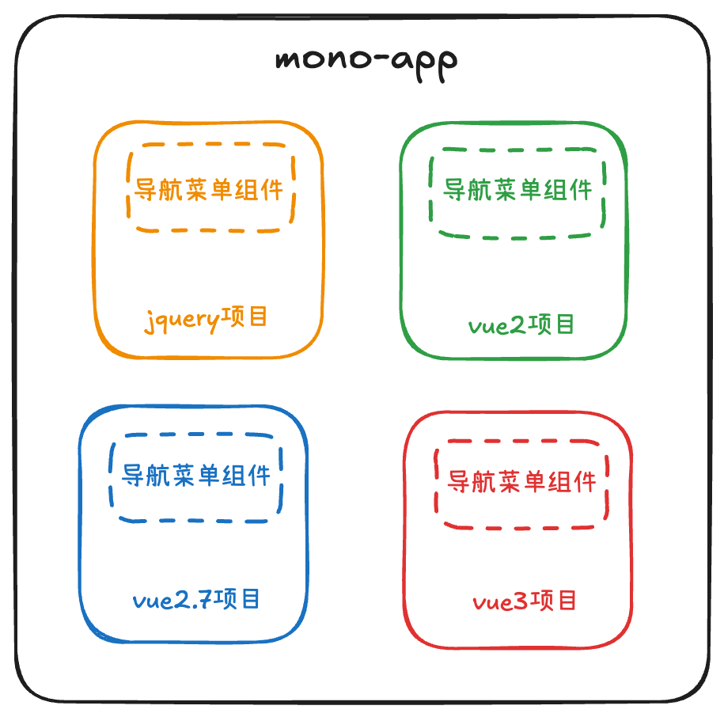
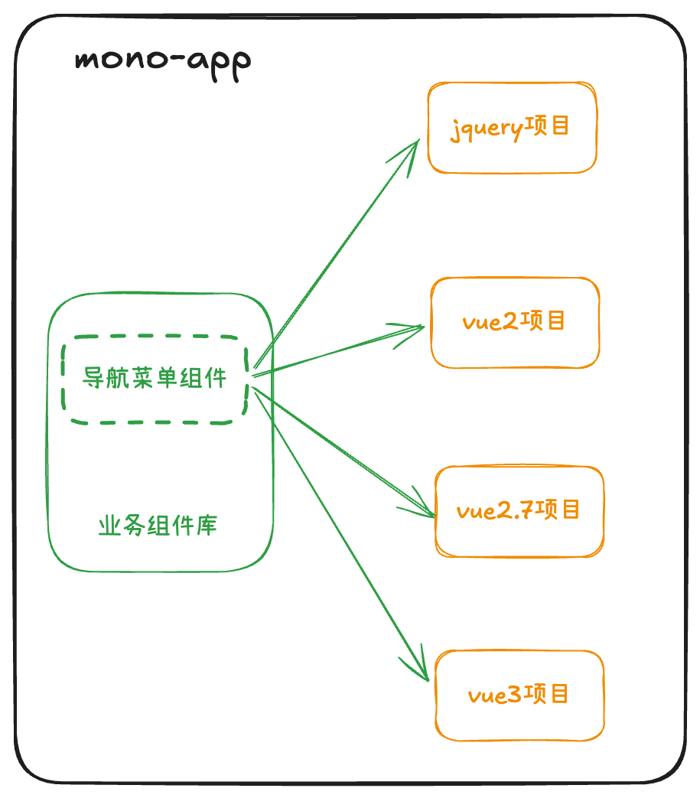
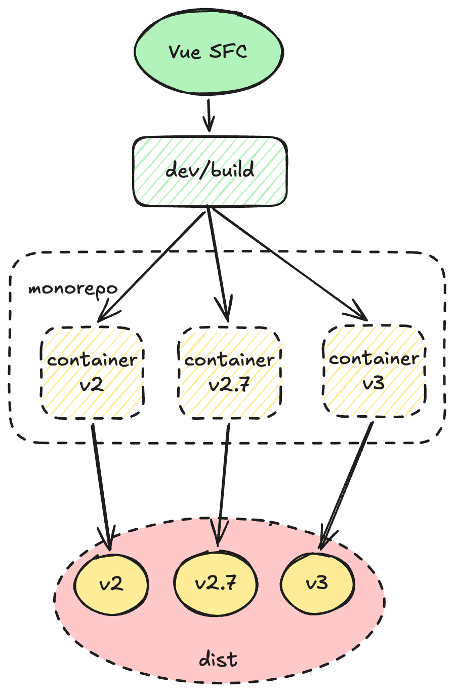

# vue 通用组件库开发

## 开发背景

在日常的 `2B` 业务开发中，我们不可避免的会遇到一个系统内部出现跨版本框架，甚至跨时代框架的使用。以我现在维护的一个项目而言，项目横跨 `jquery`, `vue2`, `vue2.7`, `vue3`。但作为同一个系统中的项目，难免会有部分业务组件有所重合。

以往的做法是，将原有的业务组件分别在各个仓库中维护。但考虑以下场景：有一个通用的业务组件（比如导航菜单），现在产品需求要优化导航菜单的交互，那么就需要在各个仓库中分别修改，然后重新打包，再发布。这样不仅效率低下，而且容易出错。还额外增加了测试的成本。



一个跨框架的巨石应用

而如果这种时候，我们的`导航菜单`组件可以避免在不同的框架中重复开发，那么开发和测试都能够节约极大的工作量，如下图所示：



使用跨框架通用组件的跨框架巨石应用

## 组件库开发

### vue 组件库原理

在开发组件库之前，我们需要先搞清楚两个问题：

1. 什么是组件？
2. 什么是组件库？

尽管我们在开发过程中更多的仍然是扮演“调包工程师”的身份，但只有搞清楚这两个问题，我们才能知道自己要开发什么，自己在开发什么

#### 什么是组件？

我们日常开发中最常接触的就是组件开发。但这里首先要澄清一个概念：组件 ≠ SFC。根据`vue`官网的[定义](https://vuejs.org/guide/scaling-up/sfc.html)

> SFC 是一种特殊的文件格式，允许我们 Vue 组件把模版、逻辑和样式聚合在一个文件中。Vue SFC 是一种框架特定的类型文件，因此必须被 `@vue/compiler-sfc` 预编译成标准的 javascript 和  css。

因此，SFC 只是 vue 组件的一种表现形式，`jsx`，`h函数`无不如是。但 SFC 是一个帮助我们理解组件的很好的切口————它最终会被编译为标准的 javascript。一个编译后的 SFC 是标准的 ES 模块，vue 官网也提供了 [SFC-playground](https://play.vuejs.org/)

于是我们的第一个问题【什么是组件？】就得到了很好的回答：

**Nothing magic, just javascript**

#### app.use 的时候发生了什么

当我们使用各种基于 vue 的插件/组件的时候，我们熟悉了这样的用法

```ts
// 摘自element-plus官网 https://element-plus.org/zh-CN/guide/quickstart.html
// main.ts
import { createApp } from 'vue';
import ElementPlus from 'element-plus';
import 'element-plus/dist/index.css';
import App from './App.vue';

const app = createApp(App);

app.use(ElementPlus);
app.mount('#app');
```

那么 `app.use()` 到底醉了哪些事情？查阅[vue3版本的 `.use` api](https://vuejs.org/api/application.html#app-use)，`.use` 归根结底只做了一件事：安装插件。

`.use` 接收一个带有 `install` 方法的对象，或者是作为 `install` 方法本身的函数。而 `install` 方法接收两个参数：`app` 和 `options`。`app` 是 `createApp` 返回的实例，`options` 是我们传入的配置项。

以 vue3 为例，我们可以在[runtime-core 源码](https://github.com/vuejs/core/blob/638a79f64a7e184f2a2c65e21d764703f4bda561/packages/runtime-core/src/apiCreateApp.ts#L158)中找到对应的类型定义

```ts
type PluginInstallFunction<Options = any[]> = Options extends unknown[]
  ? (app: App, ...options: Options) => any
  : (app: App, options: Options) => any
```

所有当我们说“vue组件库开发”的时候，实际上我们是在开发vue插件。于是，第二个问题我们也得到了解答：

**组件库是一种插件**

### 常用的打包工具

在组件库开发的时间点，前端社区流行的打包库主要有三种：[webpack](https://webpack.js.org/), [rollup](https://rollupjs.org/), [esbuild](https://esbuild.github.io/)。当然近期还有 [rspack](https://www.rspack.dev/) [rolldown](https://rolldown.rs/) 等基于 `Rust` 的打包库兴起。但由于生态和稳定性的原因，不适合用于企业生产。也正是由于这个原因，也应该放弃 `esbuild`。尽管它基于 `go` 开发，速度非常快，但生态并不完善，对于我们接下去要做的项目来说，灵活度也稍显不足。

尽管说起稳定性我们应该优先选择 `webpack`，但 `webpack` 其实并不适合作为组件库打包的工具。或者说，使用 `webpack` 打包组件库会较为麻烦，因为 `webpack` 会默认将所有依赖项打包进产物当中，为了得到合适的分发结果，需要做出很多额外的配置。

并且就 vue 生态的发展趋势而言，拥抱 `vite` 几乎是不可避免的。而 `vite` 天然基于 `rollup`。因此最终选定 `rollup` 作为组件库打包工具。

### 方案决策

因为我们的组件库需要兼容 `vue2` 和 `vue3`，在方案选择的时候有两条路：

1. dispatch 模式
2. adaptor 模式

#### dispatch 模式

> 使用 Vue SFC 进行开发，在编译阶段通过 monorepo/container 中不同版本的 template compiler 进行编译。最终由各个容器输出不同版本的产物。

理论上来说，`vue2` 和 `vue3` 的模版语法差距并不大。`vue2.7` 不仅内置了 `setup` 支持，`vue2` 也可以通过 `@vue/composition-api` 结合 `unplugin-vue2-script-setup` 来进行语法层面的抹平。



dispatch 模式原理

这种模式的优点在于：

1. 开发成本较低，不需要改变原有的开发习惯。后续交付团队后，团队成员不需要了解实现细节即可开发组件
2. 使用不同的 `container` 进行分发编译，方便进行定制化配置
3. 将不同版本的 `vue` 的代码进行了隔离

缺点：
1. 后续如果出现破坏当前 SFC 模式的 vue 版本，或者出现了新特性，组件库无法使用（比如`defineOptions` 语法糖由于 `unlugin-vite-script-setup` 没有提供，为了兼容各个vue版本，我们只能放弃使用该语法糖）

:::tip
目前社区已经有开源库使用了类似的思想，详见[tiny-vue](https://github.com/opentiny/tiny-vue/blob/dev/README.md)。虽然不是使用 `monorepo` 进行分发，但也使用了类似的思想，对不同版本的 `vue` 进行编译层的分发编译。
:::

#### adaptor 模式

> 定义内置 adaptor-runtime 语法，使用自定义的模版语法进行开发，最终打包一套产物与不同版本的runtime-adaptor，在应用中利用 adaptor 对不同版本的 vue 进行适配

优点：

1. 不需要多次编译，多版本 vue 使用相同的产物，进一步减小业务层代码差异
2. 使用 `runtime-adaptor` 方式，可扩展性极强。
3. 从编译层到运行时都由组件库内部控制，相较于 `dispatch` 模式委托 `vue/template-compiler` 和 `runtime-core` 更可控

缺点：

1. 开发成本很高，需要团队实现 `dsl`，同时还需要根据目标产物实现不同的 `adaptor-runtime`
2. `runtime-adaptor` 的存在会导致运行时有性能损耗

:::tip
adaptor 模式的实现可参考[这篇文章](https://juejin.cn/post/7243413934765916219#heading-0) 
:::

#### 选择

考虑到组件库的使用场景，综合团队规模和后期维护的复杂度，最终选择了 `dispatch模式` 进行开发

### 仓库结构

> 使用 monorepo 实现 `dispatch` 模式

#### 多版本模版编译支持

提到多版本的 `vue` 支持，自然绕不开 `vue-demi`。`vue-demi` 是 `vue` 核心团队成员 antfu 开发的一个小工具，能够支持对 vue 代码饮用的转发。[Vueuse](https://vueuse.org/) 内部就是使用了 `vue-demi`，从而实现对多版本的 `vue` 的支持.

但由于 `vue-demi` 只是对 `vue` 版本做了转发，因此如果是纯 js 库开发（例如 `@vueuse/core`）之类的库，不必关心**模版解析器冲突**的问题。而开发组件库则必须关注这个问题。因为不同版本的 `vue` 使用了不同版本的模版编译：

- vue3.x: vue/compiler-sfc
- vue2.7: vue/compiler-sfc@2.7
- vue2.6: vue-template-compiler

可以预见的是，即使使用 `render` 函数，我们也无法绕开版本问题。因此不如将这个问题提前到编译阶段解决。借助 `pnpm` 的 `monorepo` 模式，我们可以分别创建三个不同的 `vue` 仓库，利用各自不同的 `package.json` `vite.config.ts` 配置，编译多个版本的 `vue` 组件产物。

- containers/v2 -> @vue-uni-ui/v2
- containers/2.7 -> @vue-uni-ui/v2.7
- containers/v3 -> @vue-uni-ui/v3

通过在 `vite.config.ts` 中配置 `resolve.alias`，手动将 `vue` 以及 `vue-demi` 版本映射到对应的仓库内，例如 `containers/v3` 中的 `vite.config.ts` 需要配置的 `alias` 如下：

```ts
export default {
  resolve: {
    alias: {
      vue: resolve(__dirname, 'node_modules/vue/dist/vue.runtime.esm-browser.js'),
      'vue-demi': resolve(ROOT_DIR, 'node_modules/vue-demi/lib/v3/index.mjs'),
    }
  }
}
```

理论上这样我们就暂时实现了不同的容器隔离

但实际上这里有一个潜在的问题，那就是 `vue-template-compiler` 的 `vue` 依赖是没有显示的规定在 `peerDependencies` 中的。因为 `vue` 的版本需要与 `vue-template-compiler` 的版本**完全一致**，因此 `vue-template-compiler` 只是在其 `index.js` 的头部做了一次检测：

```js
try {
  var verVersion = require('vue').version
} catch (e) {}

var packageName = require('./package.json').name;
var packageVersion = require('./package.json').version;
if (vueVersion && vueVersion !== packageVersion) {
  var vuePath = require.resolve('vue');
  var packagePath = require.resolve('./package.json');
  throw new Error(
    '\n\nVue packages version mismatch:\n\n' +
      '- vue@' +
      vueVersion +
      ' (' +
      vuePath +
      ')\n' +
      '- ' +
      packageName +
      '@' +
      packageVersion +
      ' (' +
      packagePath +
      ')\n\n' +
      'This may cause things to work incorrectly. Make sure to use the same version for both.\n' +
      'If you are using vue-loader@>=10.0, simply update vue-template-compiler.\n' +
      'If you are using vue-loader@<10.0 or vueify, re-installing vue-loader/vueify should bump ' +
      packageName +
      ' to the latest.\n'
  );
}
```

这就导致我们如果在安装了多个 `vue` 仓库，那么 `vue-template-compiler` 实际引用的 `vue` 包将是不可控的。以 `pnpm` 为例，由于 `vue-template-compiler` 内部没有相关的依赖绑定，则 `require('vue')` 完全依赖于 `.pnpm` 仓库内的 `vue` 版本。

我的测试结果是 `windows` 下基本会报错，而 `mac` 下则不会报错。但开发环境不能依靠运气，这时候可以用 `pnpm` 提供的一个设置项 [pnpm.packageExtensions](https://pnpm.io/package_json#pnpmpackageextensions) 强制设置依赖。在根目录的 `pakcage.json` 下添加如下所示的代码，给 `vue-template-compiler` 添加依赖项：

```json
"pnpm": {
  "packageExtensions": {
    "vue-template-compiler": {
      "peerDependencies": {
        "vue": "~2.6.14"
      }
    }
  }
}
```

注：这里的 `~2.6.14` 需要与 `containers/v2` 中的 `vue-template-compiler` 版本一致

同时，我们修改 `path.ts` 中相关的 `VUE_LIB` 代码，将 `alias` 映射为 `containers` 内部的 `vue`，将 `vue-demi` 直接映射为对应的 `vue-demi/lib` 内部的 `index.mjs`。这样我们就实现了依赖的完全解耦。根目录的 vue 仅负责组件的开发，而 `dev` 以及 `build` 则由 `containers` 内部的 `vue` 进行编译。 

## 组件库调试

### 源码调试

`pnpm dev:3` `pnpm dev:27` `pnpm dev:2` 三个脚本可以同时执行。在各自的 `container` 内部，`resolve` 会将依赖解析为正确的地址。

注意：在编写测试用例以及开发的时候，部分语法由于 vue2 与 vue3 的解析不同，因此需要使用更为通用的写法。例如 **属性的双向绑定** 操作，在 vue2 中，模版语法糖为 `:visible.sync`，而在 vue3 中，语法糖则为 `v-model:visible`，因此需要使用二者都兼容的写法：

```vue
<script setup lang="ts">
import { ref} from 'vue-demi'

const visible = ref(false)
const updateVisible = (val: boolean) => {
  visible.value = val
}
</script>

<template>
  <uni-dialog :visible="visible" @update:visible="updateVisible"></uni-dialog>
</template>
```

### 产物调试

此调试仅需在开发阶段进行。理论上框架搭建完成后，无需每次都进行所有的产物调试。只要编译成功，产物都将包含相同的业务逻辑

